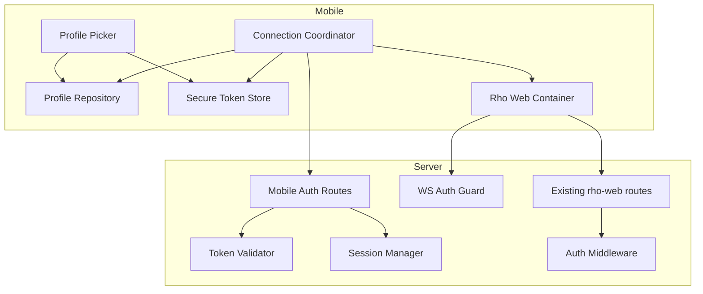
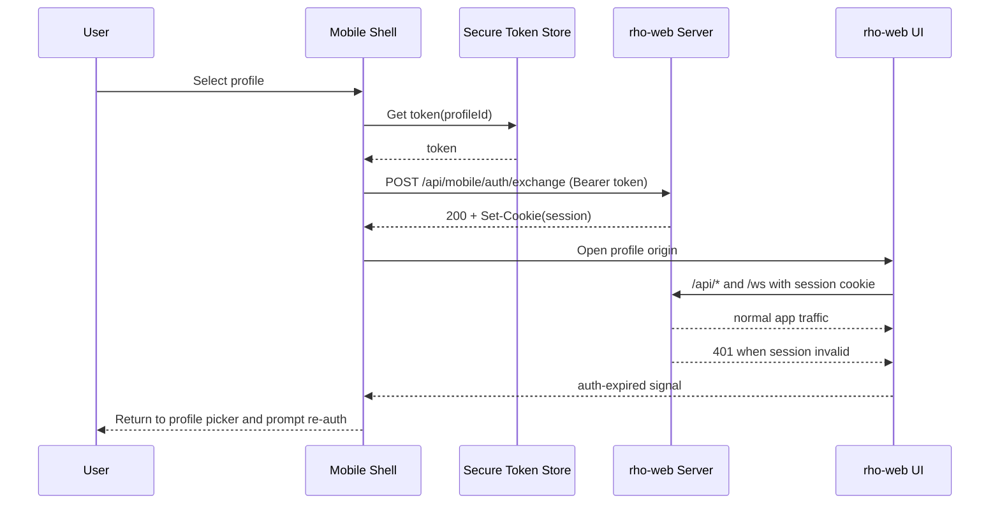

# Detailed Design: Android Capacitor Wrapper for rho-web with Secure Remote Host Profiles

## Overview

This design delivers an Android-first native app (Capacitor-based) that wraps the existing rho-web experience with minimal native shell additions:

- multi-profile host configuration (`scheme`, `host`, `port`),
- per-profile API token entry (manual paste in v1),
- native secure token storage,
- native-only token boundary (token never exposed to web JS),
- full rho-web route/feature parity once connected,
- release-ready Android build/signing pipeline.

The selected architecture is a **split-trust thin wrapper**:
1. Trusted native shell handles profiles + token storage + auth exchange.
2. Existing rho-web UI renders as the main operational surface.
3. rho-web uses a short-lived HttpOnly session cookie after native token exchange.

This keeps the wrapper thin while preventing token leakage into web runtime.

---

## Detailed Requirements

Consolidated from requirements clarification:

### Functional requirements

- **FR-01 (Platform scope):** Android is the v1 target.
- **FR-02 (Connection model):** All targets are host+port remote endpoints; localhost is just a specific host.
- **FR-03 (Auth):** API token auth only (no username/password flow in v1).
- **FR-04 (Token setup):** Manual token paste per profile in v1.
- **FR-05 (Profiles):** Support multiple saved profiles with quick switching.
- **FR-06 (Profile fields):** `name`, `scheme`, `host`, `port`, `token` only.
- **FR-07 (Per-profile secrets):** Each profile has its own token.
- **FR-08 (Startup behavior):** Auto-open last used profile; show picker if none exists.
- **FR-09 (Runtime switch):** In-app control to switch profile while using rho-web.
- **FR-10 (Session lifecycle):** Mobile session persists across app restarts until logout/profile change.
- **FR-11 (Auth failure):** On 401/expired session, app returns to profile picker and prompts re-auth.
- **FR-12 (No dedicated test button):** No explicit “test connection” action in v1.
- **FR-13 (Feature parity):** Full parity with existing rho-web routes/features, with only shell/auth/profile additions.

### Security and networking requirements

- **SR-01 (Native-only token boundary):** Token must never be exposed to web JavaScript.
- **SR-02 (Secure storage):** Tokens must use platform secure storage (Keystore/Keychain path via Capacitor-compatible secure storage).
- **SR-03 (Token transport):** Bearer token format (`Authorization: Bearer <token>`).
- **SR-04 (Session handoff):** Add server-side token exchange endpoint to mint short-lived HttpOnly session.
- **SR-05 (Trust model):** Standard OS trust only; no custom self-signed trust/pinning in v1.
- **SR-06 (Protocol policy):** HTTP allowed in v1; user controls security posture.

### Delivery and quality requirements

- **QR-01 (Thin wrapper):** Reuse existing rho-web UI, no broad native parity rewrite.
- **QR-02 (No regressions):** Preserve behavior of existing web features.
- **QR-03 (Release readiness):** Release-grade Android packaging/signing pipeline from day one.

### Out of scope (v1)

- iOS production delivery.
- Server-driven token mint/login UX.
- Custom certificate trust/pinning model.
- Expanded profile fields (path prefix, advanced proxy settings).

---

## Architecture Overview

### Selected architecture: Split-trust shell + web parity

```mermaid
flowchart LR
  A[Native Shell - Capacitor app] --> B[Profile Store: name/scheme/host/port]
  A --> C[Secure Token Store: per profile]
  A --> D[Native Auth Exchange Client]
  D --> E[rho-web server /api/mobile/auth/exchange]
  E --> F[HttpOnly mobile session cookie]
  F --> G[Remote rho-web UI container]
  G --> H[/api/* + /ws protected by session middleware]
  H --> G
  G --> I[401/session expired signal]
  I --> A
```

### Why this architecture

- Keeps existing rho-web UI intact for parity.
- Keeps token entirely outside web runtime.
- Avoids a full native rewrite.
- Contains risk from dynamic host handling by centralizing trust decisions in native shell.

---

## Components and Interfaces

### A. Mobile app components (Android-first)

1. **ProfilePickerScreen**
   - CRUD for profile metadata (`name`, `scheme`, `host`, `port`).
   - Token entry UI on create/edit.
   - Last-used profile selection logic.

2. **ProfileRepository**
   - Persists non-secret profile metadata.
   - Persists `lastUsedProfileId`.

3. **SecureTokenStore**
   - Stores/retrieves token by profile ID using secure storage plugin.
   - No token duplication in plain app prefs.

4. **ConnectionCoordinator**
   - On open profile: validate profile format, retrieve token securely, execute auth exchange.
   - On success: launch rho-web container for selected profile.
   - On failure: classify and route to UX error state.

5. **RhoWebContainer**
   - Displays remote rho-web UI for active profile.
   - Exposes profile switch action back to native shell.
   - Handles auth-expired callback path to return to picker.

6. **SessionFailureRouter**
   - Standard behavior for 401/session expiry: close active web container, return to picker, prompt re-auth.

### B. rho-web server components (new)

1. **MobileAuthRoutes**
   - `POST /api/mobile/auth/exchange`
   - `POST /api/mobile/auth/logout`
   - optional `GET /api/mobile/auth/status` (health of current mobile session)

2. **MobileTokenValidator**
   - Validates presented bearer token against configured token set (v1: static configured token hashes/env).

3. **MobileSessionManager**
   - Issues and validates short-lived mobile sessions.
   - Controls cookie issuance/refresh/revocation.

4. **AuthMiddleware**
   - Protects `/api/*` and `/ws` using mobile session.
   - Excludes explicitly public endpoints (`/api/health`, static assets, auth exchange/logout/status endpoints).

5. **WebSocketAuthGuard**
   - Enforces session validity at `/ws` upgrade.
   - Produces auth error event/close behavior consumable by mobile container.

### C. Interface contracts

#### 1) Mobile auth exchange

`POST /api/mobile/auth/exchange`

Request:
- `Authorization: Bearer <token>`
- optional metadata (app version, device id hash, profile id)

Response:
- `200 OK` + `Set-Cookie: rho_mobile_session=<opaque>; HttpOnly; Path=/; SameSite=<policy>; Secure=<when https>`
- JSON body with minimal non-secret info (`expiresAt`, `sessionId` optional)

Errors:
- `401 invalid_token`
- `429 rate_limited`
- `5xx server_error`

#### 2) Logout

`POST /api/mobile/auth/logout`
- invalidates server session
- clears cookie

#### 3) Protected routes

- Existing rho-web routes remain functionally identical under valid session.
- On invalid/expired session, protected endpoints return `401` and trigger mobile fallback behavior.

### D. Component relationship map



### E. Auth/session data flow



---

## Data Models

### Mobile app models

```ts
interface ConnectionProfile {
  id: string;
  name: string;
  scheme: "http" | "https";
  host: string;
  port: number;
  createdAt: string;
  updatedAt: string;
  lastUsedAt?: string;
}

interface LastUsedProfileRef {
  profileId: string;
  updatedAt: string;
}

interface SecureTokenRecord {
  profileId: string;
  // token value stored only in secure storage backend
}
```

### Server-side models (new)

```ts
interface MobileAuthConfig {
  enabled: boolean;
  tokenHashes: string[]; // no plaintext tokens in config files
  sessionTtlSeconds: number;
}

interface MobileSession {
  id: string;
  tokenFingerprint: string;
  createdAt: string;
  expiresAt: string;
  lastSeenAt: string;
  revokedAt?: string;
}
```

### Storage plan

- **Profile metadata:** normal app preferences/storage.
- **Profile tokens:** secure storage only.
- **Server session state:** in-memory + optional persisted backing for resilience (implementation decision in spike).

---

## Error Handling

| Scenario | Detection | User-facing behavior | System behavior |
|---|---|---|---|
| Invalid profile host/port | client validation | inline field error | block connect |
| Token missing for profile | secure store lookup | prompt token entry | do not call exchange |
| Token rejected (401) | `/auth/exchange` response | “Token invalid” + re-enter token | no session issued |
| Network unreachable | request timeout/error | “Cannot reach server” | keep profile unchanged |
| HTTP profile selected | profile scheme check | visible insecure-connection warning | proceed if user confirms |
| Session expired during use | protected API/WS returns auth failure | return to picker + re-auth prompt | clear active session state |
| Secure storage unavailable | plugin error | blocking setup error | do not persist token insecurely |
| WS auth failure | ws close/auth event | reconnect prompt or picker fallback | terminate live session |

Principles:
- Never downgrade to insecure token storage on failure.
- Never leak token in logs, URLs, or browser storage.
- Fail closed on auth boundary issues.

---

## Testing Strategy

### 1) Unit tests

- Profile validation (`scheme/host/port`).
- Secure token store adapter contract.
- Server token hash validation.
- Session cookie issue/verify/revoke helpers.

### 2) Server integration tests

- `/api/mobile/auth/exchange` success/failure paths.
- Protected `/api/*` behavior with/without valid session.
- `/ws` upgrade auth pass/fail behavior.
- Logout invalidation.

### 3) Mobile integration tests (Android)

- Create/edit/delete profile + token save.
- Startup auto-open last used profile.
- Profile switch flow.
- Session persistence across app restart.
- 401 fallback to picker.

### 4) Parity regression tests

Route/feature parity matrix must cover at least:
- Chat sessions/new/fork.
- RPC streaming over `/ws`.
- Review routes and assets.
- Tasks/memory/config APIs.
- Git context/status/diff flows.

### 5) Release gates

- Signed AAB produced in CI.
- Target SDK and policy checks.
- Smoke run on emulator/device for HTTP localhost + HTTPS remote profile.

Success criteria:
- Existing rho-web feature tests still pass.
- Mobile shell tests pass with no token leakage path.

---

## Appendices

### Appendix A: Technology choices (with pros/cons)

1. **Capacitor for Android wrapper**
   - Pros: existing team/tooling fit; fast delivery.
   - Cons: dynamic host security model needs careful constraints.

2. **Secure storage plugin (Keystore-backed)**
   - Pros: native secret boundary.
   - Cons: plugin reliability/maintenance must be monitored.

3. **HttpOnly mobile session after token exchange**
   - Pros: token never in web JS; strong separation.
   - Cons: session/cookie edge cases in WebView require testing.

4. **Stateful server sessions (preferred) vs stateless signed cookie**
   - Stateful pros: revocation/logout clarity.
   - Stateful cons: session store complexity.

### Appendix B: Research findings summary

- rho-web currently lacks general auth middleware for `/api/*` + `/ws`.
- Dynamic host support is the highest architectural risk.
- Broad use of Capacitor remote navigation settings is not ideal for arbitrary production hosts.
- Current web UI dependency on external CDNs is a mobile reliability risk.
- Recommended path is split-trust shell with native token boundary and server-issued web session.

### Appendix C: Existing solutions analysis

- **Option A:** direct remote WebView via broad config allowances — best parity, weakest security posture.
- **Option B:** local UI + remote API base URL — safer origin control, high complexity/regression risk.
- **Option C (selected):** split-trust shell + remote web parity — best balance for v1.
- **Option D:** gateway/BFF — strongest security, highest operational overhead.

### Appendix D: Constraints and limitations

- HTTP allowed in v1 means explicit risk warnings are required.
- No custom certificate trust for self-signed certs in v1.
- Token issuance UX is out-of-scope (manual token paste only).
- Android-first means iOS parity is deferred.

---

## Connections

- [[../rough-idea.md]]
- [[../idea-honing.md]]
- [[../research/rho-web-baseline-and-gaps.md]]
- [[../research/capacitor-security-and-session-patterns.md]]
- [[../research/android-networking-and-release-readiness.md]]
- [[../research/risk-register-and-mitigation-plan.md]]
- [[../research/dynamic-host-architecture-spike.md]]
- [[openclaw-runtime-visibility-inspiration]]
