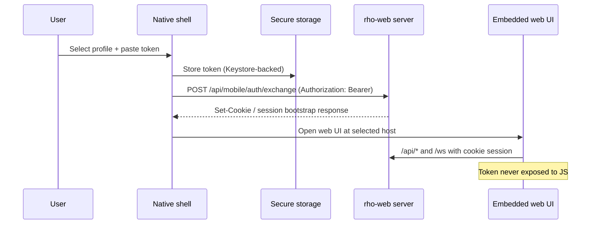

# Capacitor Security and Session Patterns (Android-first)

## Goal

Define a secure v1 pattern for:
- native-only token handling,
- per-profile secure token storage,
- rho-web auth via short-lived HttpOnly session,
- no token exposure to web JavaScript.

## Recommended pattern for rho v1

### Native-only token + server session bootstrap

1. User selects profile (`scheme`, `host`, `port`) and pastes API token.
2. Native layer stores token in secure storage (Keystore-backed on Android).
3. Native layer calls rho-web mobile auth exchange endpoint over target host.
4. Server validates token and issues short-lived mobile session (HttpOnly cookie).
5. Embedded rho web UI runs with cookie session only; token never reaches JS.

## Why this pattern fits your clarified requirements

- Supports multi-profile remote hosts.
- Keeps implementation KISS for v1 (manual token paste).
- Preserves thin-wrapper strategy and route parity.
- Avoids exposing durable auth secrets to JS runtime.

## Implementation caveats to handle early

1. **Cookie behavior in WebView is strict**
   - Use proper cookie attributes (`HttpOnly`; `Secure` where HTTPS; `SameSite` strategy aligned to origin model).
   - Watch cross-site cases if shell origin differs from target host.

2. **Do not rely on web storage for secrets**
   - Capacitor `Preferences` is not a secure secret store.

3. **Header-injection fallback is weaker than cookie-session/BFF pattern**
   - Even if JS cannot read token, malicious JS can still trigger authenticated requests.

4. **Avoid URL token transport**
   - No token in query params/deep-link payloads.

## Secure storage options (practical)

- Prefer a maintained Capacitor secure storage plugin backed by Android Keystore / iOS Keychain.
- Keep token payloads small; store only secrets (not large app state).
- Profile metadata (`name/scheme/host/port`) can live in normal app prefs; profile token material must stay secure-store only.

## Suggested rho-web endpoint shape

- `POST /api/mobile/auth/exchange`
  - input: bearer API token (+ optional profile fingerprint/device nonce)
  - output: short-lived session cookie + session metadata
- `POST /api/mobile/auth/logout`
  - revoke/clear mobile session
- middleware guard for `/api/*` + `/ws`
  - allow either valid mobile session cookie (web path) or bearer only for bootstrap endpoint(s)

## Sources

- https://capacitorjs.com/docs/guides/security
- https://capacitorjs.com/docs/apis/http
- https://capacitorjs.com/docs/apis/cookies
- https://capacitorjs.com/docs/apis/preferences
- https://developer.android.com/reference/android/webkit/CookieManager
- https://developer.android.com/privacy-and-security/keystore
- https://developer.android.com/privacy-and-security/risks/insecure-webview-native-bridges
- https://github.com/aparajita/capacitor-secure-storage
- https://capawesome.io/plugins/secure-preferences/

## Connections

- [[../idea-honing.md]]
- [[rho-web-baseline-and-gaps.md]]
- [[android-networking-and-release-readiness.md]]
- [[risk-register-and-mitigation-plan.md]]
- [[_index]]
- [[openclaw-runtime-visibility-inspiration]]
