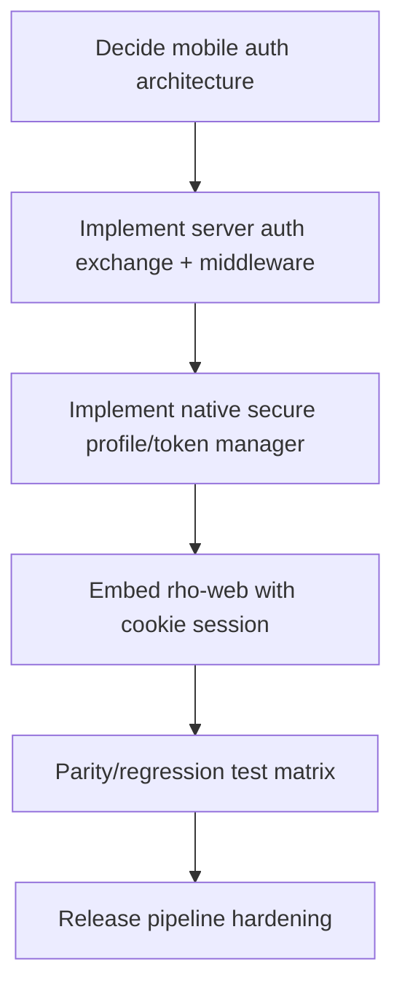

# Risk Register and Mitigation Plan

## Objective

Surface implementation surprises early and define pre-design mitigation spikes.

## Top risks

| ID | Risk | Impact | Likelihood | Early mitigation |
|---|---|---|---|---|
| R1 | rho-web currently has no general auth gate for `/api/*` and `/ws` | Critical | High | Add auth/session middleware design before UI implementation |
| R2 | Arbitrary-host profile model conflicts with conservative Capacitor navigation defaults | High | Medium | Run technical spike for dynamic host loading model |
| R3 | HTTP support in v1 requires cleartext allowances | High | Medium | Add explicit HTTP warning UX + controlled Android network config |
| R4 | Token leakage path if web JS can access token | Critical | Medium | Enforce native-only token + server session bootstrap |
| R5 | Cookie/session behavior differences in WebView | High | Medium | Build auth exchange prototype and verify persistence/resume/logout |
| R6 | Feature parity regressions while introducing auth | High | Medium | Create parity regression matrix from existing routes/features |
| R7 | Release pipeline churn (signing/toolchain/policy) | Medium | Medium | Set up signed AAB CI gate early |
| R8 | CDN-delivered frontend dependencies fail or drift in mobile environments | Medium | Medium | Consider vendoring critical frontend assets |
| R9 | Dynamic host loading with full Capacitor bridge exposes plugin attack surface | Critical | Medium | Use split-trust model and minimize bridge exposure for remote-host context |

## Critical path dependencies

## Recommended pre-implementation spikes

1. **Spike A: Dynamic host loading in Capacitor shell**
   - Validate profile switch behavior for different hosts.
   - Verify route/WS parity survives host switch.

2. **Spike B: Auth exchange prototype**
   - Build minimal `/api/mobile/auth/exchange` and protected `/api/health/auth`.
   - Verify token never appears in web JS context.

3. **Spike C: HTTP + HTTPS matrix**
   - Test localhost HTTP, LAN HTTP, public HTTPS with standard trust.
   - Confirm expected failure surfaces and user messaging.

4. **Spike D: Release-ready Android build**
   - Produce signed AAB from CI.
   - Validate repeatable build and artifact checks.

## Exit criteria to move into detailed design

- Auth/session pattern chosen and validated by spike.
- Dynamic host strategy proven workable for multi-profile switch.
- Cleartext/HTTPS behavior intentionally defined (not accidental).
- Parity test plan drafted from current rho-web route/feature map.

## Sources

- [[rho-web-baseline-and-gaps.md]]
- [[capacitor-security-and-session-patterns.md]]
- [[android-networking-and-release-readiness.md]]
- [[dynamic-host-architecture-spike.md]]

## Connections

- [[../idea-honing.md]]
- [[rho-web-baseline-and-gaps.md]]
- [[capacitor-security-and-session-patterns.md]]
- [[android-networking-and-release-readiness.md]]
- [[dynamic-host-architecture-spike.md]]
- [[_index]]
- [[openclaw-runtime-visibility-inspiration]]
