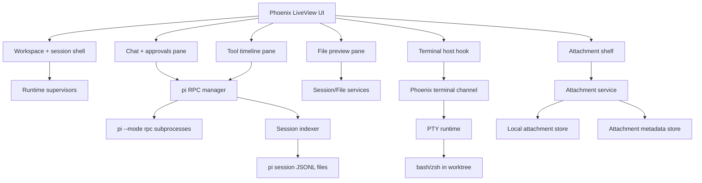
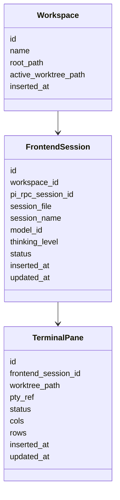

# Detailed Design — pi LiveView Desktop Frontend

## Overview

This project will create a separate Phoenix application that provides a desktop-class web frontend for the pi coding agent. The product target is **capability parity with the Codex desktop application for the agent-centric surfaces**, while intentionally excluding built-in code editing, local git operations, and memory/vault/task views in the first serious version.

The app is a **local-first desktop-style PWA** that runs on `localhost`, talks to a **local pi process**, and supports multiple workspaces/worktrees and their associated sessions. It uses a clear Elixir/Phoenix/LiveView approach rather than cloning Codex visually.

The defining product requirement is that this is **not just chat**. It is a multi-pane workspace for operating pi:
- session and workspace switching
- streaming chat
- model selection and thinking controls
- tool-call visibility and approvals
- embedded first-class terminal panes via libghostty
- read-only file review surfaces
- attachment upload with per-session attachment history
- desktop-friendly settings, status, and notifications

For localhost mode, there is **no auth**. The PWA requirement for v1 is modest: it should install and reopen cleanly, but meaningful offline operation while pi or Phoenix is unavailable is a non-goal.

A future hosted mode should remain architecturally possible, but the design optimizes for local trust, local performance, and a local pi runtime first.

## Detailed Requirements

### Product scope

1. The application must aim for **feature parity with the Codex desktop application** across the main agent-operating surfaces, not just chat.
2. The UI must be **desktop-browser-first** and installable as a **PWA**.
3. The app must run **locally on localhost** against a **local pi process**.
4. The system must leave room for a future mode where the frontend can drive a **remote pi instance**, but that is not the first target.
5. The frontend must take a **clear Phoenix/LiveView-native approach**, not a pixel clone of Codex.

### Explicit inclusions

6. The app must include the following core surfaces in the first serious version:
   - chat thread
   - session list
   - streaming output
   - tool-call timeline
   - approvals
   - terminal panes
   - settings/model selection
   - read-only file preview
   - notifications/status
   - multi-session support
7. The app must support **multiple local projects/worktrees and their associated pi sessions** from the start.
8. The app must preserve pi's **existing approval model and event stream semantics** rather than redesigning them.
9. The app must support **per-session model selection** and **thinking-level controls** in chat.
10. The first milestone must prove that the system can:
   - connect to a local pi instance
   - stream chat replies
   - expose model selection and thinking-level controls
   - handle file uploads for multimodal models
11. The app must support **per-session attachment history** as a first-class surface.
12. The read-only file surface must show:
   - files pi touched or referenced in the session
   - files available in the current git worktree
13. Terminal panes must be **embedded first-class panes** inside the main layout.
14. Terminal panes must use **libghostty-based embedding** and must work; this design does not include a non-libghostty terminal fallback path.

### Explicit exclusions

15. The first serious version must **exclude built-in code editing**.
16. The first serious version must **exclude local git operations**.
17. The first serious version must **exclude memory, vault, and task views**.
18. First-class tablet/mobile layouts are out of scope for v1.
19. Meaningful offline workflow support while pi is unavailable is out of scope for v1.

### Security and trust

20. Localhost mode must run with **no auth**.
21. The system must still preserve explicit approval handling for tools/actions as defined by pi.
22. The system must clearly communicate connection, streaming, approval, and terminal runtime states.

### Repository / deployment shape

23. The frontend must be built as a **separate Phoenix application in its own repository**.
24. Integration with pi must happen through **explicit process/network boundaries**, not in-process embedding into pi.

## Architecture Overview

The system is split into four major runtime planes:
1. **LiveView UI plane** for desktop workspace rendering and interaction
2. **pi session control plane** for spawning and managing `pi --mode rpc` processes
3. **terminal plane** for libghostty-based embedded terminal panes backed by local PTYs
4. **artifact plane** for session metadata, read-only file previews, and attachments

### Top-level architecture

### Architectural decisions

- **Use Phoenix LiveView as the primary UI model**. The app is server-stateful by design.
- **Use pi RPC directly** as the live control boundary. Do not introduce a separate adapter service in v1.
- **Use session-file reads for history/listing** rather than booting live pi processes for every session list interaction.
- **Use libghostty-based browser embedding** for terminals, backed by a Phoenix Channel and local PTYs.
- **Use local attachment storage** for localhost mode, with an abstraction that can later swap to object storage in hosted mode.
- **Separate chat/session control from terminal control**. pi RPC and terminal PTYs are related in the UX, but they are distinct runtime systems.

## Components and Interfaces

### 1. Root Workspace Shell

**Responsibility**
- Own the desktop layout
- Manage active workspace/worktree selection
- Manage active session selection
- Route updates to subordinate panes
- Restore UI state on reconnect/reopen

**Key concepts**
- `workspace_id`
- `worktree_path`
- `frontend_session_id`
- `pi_rpc_session_id`
- `session_file`

**Primary UI surfaces**
- left sidebar: workspaces, worktrees, sessions
- center pane: transcript + composer
- right pane: tool timeline / files / attachments context
- bottom dock: embedded terminal pane(s)
- global top/bottom chrome: status, notifications, model, connection state

### 2. pi RPC Manager

**Responsibility**
- Spawn and supervise `pi --mode rpc` processes
- Send commands to the correct subprocess
- Parse JSONL responses/events
- Maintain per-session event buffers and derived session state
- Translate `extension_ui_request` into LiveView approval/input flows

**Interface to pi**
- Commands sent over stdin JSONL:
  - `prompt`
  - `steer`
  - `follow_up`
  - `abort`
  - `get_state`
  - `get_messages`
  - `set_model`
  - `set_thinking_level`
  - `new_session`
  - `switch_session`
  - `fork`
  - `get_commands`
- Events consumed from stdout JSONL:
  - `agent_start` / `agent_end`
  - `message_start` / `message_update` / `message_end`
  - `tool_execution_start` / `tool_execution_update` / `tool_execution_end`
  - `extension_ui_request`
  - retry/compaction events

**Derived state exposed to LiveView**
- current streaming status
- pending approvals
- transcript message state
- tool timeline state
- per-session model/thinking level
- command palette entries
- last event sequence / replay cursor

### 3. Session Indexer and History Service

**Responsibility**
- Read pi session JSONL files directly from disk
- Produce fast session summaries for lists/search/resume
- Surface names, first prompts, timestamps, usage summaries, parent relationships
- Provide transcript snapshot hydration for reconnect/open flows

**Design choice**
This service is read-optimized and separate from live RPC state. It is allowed to lag live state slightly, but the app should merge disk-derived and runtime-derived information cleanly.

### 4. Chat and Approvals Pane

**Responsibility**
- Render user and assistant transcript
- Render streamed text, thinking blocks, tool call mentions, and attachment references
- Accept prompt input, slash commands, model changes, and thinking-level changes
- Render and resolve approvals produced through `extension_ui_request`

**Important streaming rule**
- text/token output is streamed incrementally
- tool execution partials are streamed incrementally
- expensive formatting is deferred when possible until finalization

**Approval model**
The pane mirrors pi semantics exactly:
- confirm/select/input/editor requests are rendered as UI dialogs or inline approval cards
- approval resolution returns the corresponding `extension_ui_response`
- no app-specific approval DSL is introduced in v1

### 5. Tool Timeline Pane

**Responsibility**
- Show chronological tool execution history
- Display tool name, arguments, start time, status, errors, and final/partial output
- Highlight currently running tools and pending approvals
- Support filtering by status/type/session scope

**Design constraints**
- timeline data must be independent from transcript rendering so the app can render tool activity even if transcript formatting is delayed
- partial tool output must use replacement semantics because pi's `partialResult` is cumulative

### 6. File Preview Service and Pane

**Responsibility**
- Show read-only previews of files surfaced by session context or available in the active worktree
- Track provenance: touched by pi, referenced in transcript, referenced by tool result, or discovered in worktree
- Render text, images, and basic document previews

**v1 behavior**
- read-only only
- no in-app edit/save
- no git staging/revert flows
- worktree browsing limited to safe read patterns and active workspace boundaries

### 7. Attachment Service and Shelf

**Responsibility**
- Accept uploads from the composer
- Track upload/processing state
- Persist session-scoped attachment history
- Reattach prior artifacts to later turns
- Enforce model/provider compatibility checks

**Attachment states**
- `pending`
- `uploading`
- `attached`
- `processing`
- `ready`
- `failed`
- `removed`

**Design choice**
For localhost mode, attachments are stored locally under an app-owned data directory and tracked in metadata tables. The storage abstraction supports a future hosted/object-store implementation, but v1 is optimized for local persistence and low complexity.

### 8. Terminal Runtime

**Responsibility**
- Provide embedded first-class terminal panes via libghostty-based web embedding
- Maintain PTY-backed shell lifecycles per terminal pane
- Bind terminal panes to active worktree/session context
- Handle resize, clipboard, selection, reconnect, and pane lifecycle

**Non-negotiable design constraint**
This project does **not** define a non-libghostty terminal fallback path. The design requires a working libghostty-based embedded pane solution.

**Chosen implementation direction**
- browser-side terminal layer built on **libghostty-vt / ghostty-web style integration**
- Phoenix Channel for byte transport
- Elixir PTY runtime for local shell management
- pane lifecycle under OTP supervision

**Terminal success bar**
A terminal pane is not “done” until it supports:
- embedded rendering in the app layout
- keystroke input
- shell output streaming
- resize handling
- copy/paste
- disconnect/reconnect state recovery
- worktree scoping

### 9. Notifications and Status Layer

**Responsibility**
- Show global runtime health
- Surface pending approvals, disconnected sessions, failing terminals, and upload errors
- Provide unobtrusive desktop-style visibility into what is happening now

**Core status dimensions**
- Phoenix connectivity
- pi runtime connectivity
- per-session streaming/running status
- pending approval count
- terminal state
- attachment failure state

## Data Models

### Core identity model

### Transcript and tool model

| Entity | Key fields |
|---|---|
| `transcript_message` | `id`, `frontend_session_id`, `role`, `content_blocks`, `stream_status`, `source_entry_id`, `inserted_at` |
| `tool_timeline_item` | `id`, `frontend_session_id`, `tool_call_id`, `tool_name`, `args_json`, `status`, `partial_output`, `final_output`, `is_error`, `started_at`, `ended_at` |
| `approval_request` | `id`, `frontend_session_id`, `request_kind`, `title`, `payload_json`, `status`, `expires_at`, `resolved_at` |

### Attachment model

| Field | Purpose |
|---|---|
| `attachment_id` | stable identifier |
| `frontend_session_id` | session ownership |
| `message_id` | optional first-use association |
| `file_name` | display name |
| `mime_type` | capability checks |
| `kind` | image/pdf/audio/document/other |
| `size_bytes` | size checks |
| `storage_ref` | local file path or storage key |
| `preview_ref` | thumbnail/preview reference |
| `status` | lifecycle state |
| `provider_visibility` | supported/unsupported/unknown for current model |
| `extracted_text` | optional OCR/transcript |
| `error_message` | failure detail |
| `created_at` | history ordering |
| `last_used_at` | reuse support |

### File surface model

| Entity | Key fields |
|---|---|
| `file_reference` | `id`, `frontend_session_id`, `path`, `source_kind`, `source_ref`, `mime_type`, `preview_kind`, `inserted_at` |
| `worktree_entry` | `workspace_id`, `path`, `entry_type`, `size_bytes`, `last_modified_at` |

### Event buffer model

A replay buffer is required to support reconnect and PWA reopen behavior.

| Entity | Key fields |
|---|---|
| `session_event` | `seq`, `frontend_session_id`, `event_type`, `payload_json`, `inserted_at` |

The buffer can be backed by ETS plus durable snapshots or database persistence depending on implementation constraints, but the interface must support replay-from-sequence semantics.

## Error Handling

### Principles

1. **Never silently drop runtime state.** If the UI cannot fully restore, show degraded state explicitly.
2. **Keep failure surfaces local and visible.** Chat failures, terminal failures, and attachment failures should not collapse into one generic error banner.
3. **Favor recoverable session continuity.** Reconnect and retry should preserve operator context whenever possible.

### Error categories

#### pi RPC errors
- spawn failure
- malformed JSONL line
- stdout/stderr closure
- session switch failure
- unsupported command or model failure
- extension UI request timeout

**Handling**
- mark frontend session as degraded
- show actionable session-level banner
- keep historical transcript visible
- allow reconnect or session restart from UI

#### Streaming/rendering errors
- malformed content block
- markdown/render exception
- oversized transcript update

**Handling**
- preserve raw text fallback rendering for the affected message
- do not lose the underlying event record
- isolate rendering errors from the rest of the session

#### Terminal errors
- PTY spawn failure
- libghostty hook mount failure
- channel disconnect
- resize/input transport errors
- pane crash or zombie cleanup failure

**Handling**
- keep pane shell visible as failed/disconnected rather than disappearing
- provide explicit reconnect/recreate action
- persist pane metadata so the user understands what died
- terminal completion is blocked until embedded libghostty behavior works end-to-end

#### Attachment errors
- unsupported type for selected model
- oversize file
- upload interruption
- local persistence failure
- preview generation failure

**Handling**
- keep attachment in visible failed state
- allow remove/retry
- preserve session history record of failed artifact attempts where useful

#### File preview errors
- path outside active workspace boundary
- unreadable file
- unsupported preview type

**Handling**
- show metadata and failure reason
- do not silently omit the file from surfaced references

## Testing Strategy

### Testing goals

The system must be validated as an integrated desktop-class operator surface, not just a bag of unit-tested parts.

### 1. Unit tests

Cover:
- pi RPC framing/parser logic
- event routing and replay buffering
- session summary extraction from JSONL files
- attachment metadata/state transitions
- approval request state machine
- file preview provenance logic
- terminal pane lifecycle state machine

### 2. Integration tests

Cover:
- spawning pi RPC process and handling streamed transcript events
- switching among multiple workspaces/worktrees
- reading historical sessions while a live session is active
- handling `extension_ui_request` and sending `extension_ui_response`
- attachment upload + session history persistence
- file preview from both session-linked and worktree-linked paths
- terminal input/output/resize through Phoenix Channel and PTY runtime

### 3. End-to-end desktop workflow tests

The critical flows must be used end-to-end in a browser harness:
- open app, select workspace, open session, send prompt, stream reply
- switch model and thinking level, then continue chatting
- approve a tool action and observe timeline update
- attach a file, send it, see it in transcript and session attachment shelf
- open a read-only file preview
- create and use an embedded terminal pane
- switch to another worktree/session and back without losing context
- install PWA and reopen into a valid workspace/session shell

### 4. Hard acceptance gates

The following are release gates, not “nice to have” checks:
- streaming chat remains responsive under live tool output
- multiple workspaces/worktrees can be switched without state corruption
- approvals function through pi's native semantics
- attachment history survives reload/reopen
- at least one embedded libghostty-based terminal pane works reliably in the app layout
- no silent mismatch between history read from disk and live session state

### 5. Performance and resilience tests

- long transcript stream with many tool updates
- reconnect during active streaming
- reopen installed PWA while Phoenix restarts
- terminal pane disconnect/reconnect under load
- repeated session switching across multiple worktrees

## Appendices

### Appendix A — Technology Choices

| Area | Choice | Why |
|---|---|---|
| UI framework | Phoenix LiveView | server-owned streaming UI fits the control plane well |
| Live agent boundary | `pi --mode rpc` subprocesses | existing explicit protocol; avoids pi fork/in-process coupling |
| Session history | direct JSONL reads | faster than waking RPC for historical views |
| Terminal rendering | libghostty-based web embedding | explicit product requirement for embedded libghostty panes |
| Terminal transport | Phoenix Channel | fits bidirectional terminal byte stream well |
| Terminal backend | local PTY service under OTP supervision | correct boundary for browser/PWA architecture |
| Attachment storage | local filesystem-backed store + metadata DB | matches localhost-first deployment and keeps v1 simple |
| PWA model | installable localhost shell | matches modest install/reopen requirement |

### Appendix B — Research Findings Summary

#### Major technology choices with pros and cons

**Phoenix LiveView**
- Pros: strong for server-stateful streaming UI, multi-pane composition, approvals, reconnect-aware flows
- Cons: easy to misuse with over-rendering or too much client-side hook logic

**pi RPC**
- Pros: already explicit enough for a real frontend; strong event model; no pi fork required
- Cons: requires careful JSONL framing, event buffering, and subprocess lifecycle management

**libghostty-based terminal embedding**
- Pros: aligns with product requirement; promising direction for a serious embedded terminal experience
- Cons: public embedding surface is still early; implementation discipline is required to make it actually work

**Local attachment store for localhost mode**
- Pros: simpler than object storage; aligned with local-first trust and deployment
- Cons: hosted mode will require a storage abstraction and migration path later

#### Existing solutions analysis

- Codex desktop establishes the bar as a **workspace product**, not a transcript viewer.
- rho's web implementation demonstrates practical patterns for:
  - RPC lifecycle management
  - session indexing from disk
  - reconnect/replay concepts
  - streaming chat/tool event routing
- community agent dashboards repeatedly reinforce the value of:
  - live activity visibility
  - approval visibility
  - session health and connection state
  - strong filtering rather than raw firehose output

#### Alternative approaches considered

1. **Build inside the pi repo**
   - Rejected because the requirement is for a separate Phoenix repo with explicit integration boundaries.

2. **Introduce an adapter service in front of pi**
   - Deferred because direct RPC is already workable and simpler for v1.

3. **Non-libghostty terminal fallback**
   - Rejected by product direction. The design requires a working embedded libghostty-based pane.

4. **Offline-first collaborative/local-sync-heavy PWA**
   - Rejected for v1 because it adds complexity beyond the stated install/reopen requirement.

5. **Object-store-first attachment architecture for localhost mode**
   - Deferred in favor of a simpler local store for v1, while preserving abstraction for hosted mode later.

#### Key constraints and limitations identified during research

- pi history and live state are split across disk and subprocess runtime; the frontend must reconcile both.
- libghostty embedding in web/PWA environments is still maturing; correctness has to be proven in implementation, not assumed.
- LiveView can handle this app well, but only if streaming hot paths are carefully isolated.
- PWA installability on localhost is viable, but it does not eliminate the need for reconnect-aware backend state restoration.

## Connections

- [[../rough-idea.md]]
- [[../idea-honing.md]]
- [[../research/README.md]]
- [[../research/pi-integration-surface.md]]
- [[../research/codex-desktop-benchmark.md]]
- [[../research/liveview-pwa-patterns.md]]
- [[../research/terminal-embedding-libghostty.md]]
- [[../research/multimodal-attachments.md]]
- [[libghostty-embedding-phoenix]]
- [[small-improvement-rho-dashboard]]
- [[rho-dashboard-improvements-2026-02-14]]
- [[rho-dashboard-improvements-2026-02-15-16]]
- [[openclaw-runtime-visibility-inspiration]]
- [[session-health-monitor-inspiration]]
- [[rho-dashboard-live-activity-filters-inspiration-2026-02-14]]
