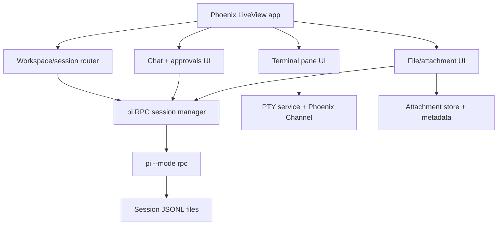

# Research Overview

This research pass used local pi documentation, the installed pi source/docs, the existing rho web implementation, parallel scout subagents, Codex web search, Brave web search, X search, and the local vault.

## Research Set

- [[pi-integration-surface.md]]
- [[codex-desktop-benchmark.md]]
- [[liveview-pwa-patterns.md]]
- [[terminal-embedding-libghostty.md]]
- [[multimodal-attachments.md]]

## Cross-Cutting Takeaways

1. **pi is already frontendable**: the RPC protocol is explicit enough to drive a serious UI without forking pi.
2. **Phoenix fits the control plane well**: LiveView is a good match for session state, streaming chat, approvals, and multi-workspace routing.
3. **Terminals are the hardest surface**: libghostty is promising, but today the practical route is browser-side WASM terminal emulation plus server-side PTY management.
4. **PWA should stay modest in v1**: install/reopen cleanly on `localhost`; do not pretend the app is meaningfully offline when pi is unavailable.
5. **Attachment handling should not stay base64-only**: a real desktop-class frontend needs session-scoped attachment history, explicit metadata, and backend-aware validation.
6. **Codex parity means workspace UX, not just chat**: sessions, approvals, tool visibility, terminal panes, settings, attachment history, and file review are the real bar.

## Recommended Design Direction

## Most Important Open Design Choices

- Whether to talk to pi **only via spawned RPC subprocesses** or add a small stable adapter service in front of pi.
- Whether embedded terminals should use **libghostty-vt WASM immediately** or start with a safer fallback and keep libghostty as an integration target.
- Whether attachments in v1 should be **images-first** or support broader document modalities from the start.
- How aggressively to support **multi-worktree switching** in the first implementation milestone.

## Source Mix

- Local docs: pi `README.md`, `docs/rpc.md`, `docs/session.md`
- Local implementation references: `rho/web/*`
- Web research: official Codex docs, MDN, Phoenix docs, Ghostty docs, vendor file APIs
- Community signals: X search around OpenClaw / agent dashboards
- Vault patterns: rho-dashboard / observability / libghostty notes

## Connections

- [[../idea-honing.md]]
- [[pi-integration-surface.md]]
- [[codex-desktop-benchmark.md]]
- [[liveview-pwa-patterns.md]]
- [[terminal-embedding-libghostty.md]]
- [[multimodal-attachments.md]]
- [[small-improvement-rho-dashboard]]
- [[rho-dashboard-improvements-2026-02-14]]
- [[rho-dashboard-improvements-2026-02-15-16]]
- [[openclaw-runtime-visibility-inspiration]]
