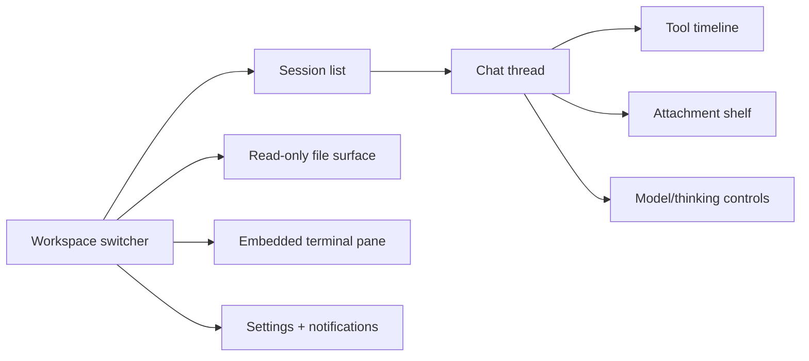

# Codex Desktop Benchmark

## Purpose

This document translates “feature parity with Codex desktop” into a practical benchmark for this project. The goal is **capability parity**, not a pixel clone.

## Headline Conclusion

For this project, Codex parity means shipping a **multi-pane agent workspace**, not a chat box.

The must-match surfaces are:
- multi-session / multi-worktree switching
- streaming chat
- model selection and thinking controls
- approval handling
- tool-call visibility
- embedded terminal panes
- attachment upload + per-session attachment history
- read-only file review surfaces
- settings / notifications / status

The intentionally deferred surfaces are:
- built-in code editing
- local git operations
- memory / vault / task views

## Capability Breakdown

### Must-match core

| Surface | Why it matters | v1 interpretation |
|---|---|---|
| Sessions / projects | Codex is project- and thread-oriented | support multiple worktrees/projects and session switching from the start |
| Chat thread | core operator surface | streaming chat with persistent history |
| Model controls | directly requested in requirements | per-session model picker + thinking-level controls |
| Approvals | trust boundary for tool execution | preserve pi approval semantics via UI dialogs |
| Tool visibility | desktop-class operator confidence | timeline with args, status, output, errors |
| Terminal panes | explicit requirement | embedded first-class panes, not detached windows |
| Attachments | explicit requirement | composer upload + per-session attachment history |
| File views | review-oriented workflow | read-only preview for touched files + worktree files |
| Notifications / status | desktop feel | visible pending approvals, streaming/running status |
| Settings | control plane | workspace/model/behavior controls |

### Likely polish, not critical for first serious version

- floating utility windows
- voice dictation
- review diff tooling as rich as Codex git review
- cloud-mode UX
- automations / scheduled background tasks UI
- advanced approval policies beyond basic ask/block modes

## What Codex suggests about product shape

Official Codex docs show a product shaped around:
- project-scoped sessions
- integrated terminal execution
- explicit approvals and sandboxing
- review surfaces for agent work
- desktop-class convenience rather than raw transcript exposure

That maps well to your stated requirements, with one important correction: because you are excluding code editing and git operations, the product should bias toward **agent runtime visibility + control**, not “mini IDE”.

## Recommended parity target for this project

## Product-Level Implications

### 1. Session and workspace switching is first-class

Because requirements call for multiple projects/worktrees from the start, the app needs a left-nav or command-palette model closer to a desktop workspace shell than a single-thread app.

### 2. Tool visibility should be explicit, not hidden in transcript noise

Codex parity is not just “you can see tool output somewhere.” It implies the operator can quickly answer:
- what is running now?
- what tool just ran?
- did it succeed?
- what requires approval?

### 3. Attachments need to feel persistent at the session level

A real desktop-class workflow does not treat uploads as one-shot transient blobs. Your requirement for per-session attachment history is the right call and should be treated as part of parity, not an add-on.

### 4. Review > editing in v1

Since code editing and git are deferred, the file surface should focus on:
- files referenced by pi
- files in the active worktree
- image/PDF/text preview
- provenance from the session or tool call that surfaced the file

## Useful Official Sources

- https://developers.openai.com/codex/app
- https://developers.openai.com/codex/app/features
- https://developers.openai.com/codex/app/settings
- https://developers.openai.com/codex/app/review
- https://developers.openai.com/codex/app/commands
- https://developers.openai.com/codex/agent-approvals-security
- https://help.openai.com/en/articles/11369540-using-codex-with-your-chatgpt-plan/
- https://openai.com/index/introducing-the-codex-app/

## Secondary Signals

The X/community dashboard ecosystem around OpenClaw repeatedly emphasizes:
- live activity feeds
- approval gates
- session health visibility
- “what is happening right now?” over static logs

That is not authoritative for Codex itself, but it is useful evidence for what operators expect from serious agent desktop UIs.

Examples from X research:
- OpenClaw Studio / Control Panel / Mission Control style dashboards
- live agent activity + token usage + approval visibility patterns

## Connections

- [[../idea-honing.md]]
- [[README.md]]
- [[pi-integration-surface.md]]
- [[liveview-pwa-patterns.md]]
- [[terminal-embedding-libghostty.md]]
- [[multimodal-attachments.md]]
- [[small-improvement-rho-dashboard]]
- [[openclaw-runtime-visibility-inspiration]]
- [[rho-dashboard-live-activity-filters-inspiration-2026-02-14]]
