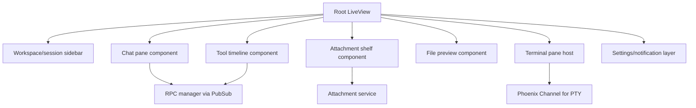

# Phoenix LiveView + PWA Patterns

## Executive Take

Phoenix LiveView is a strong fit for the **control plane** of this app: sessions, approvals, streaming transcript state, layout composition, notifications, and workspace switching.

It is a weaker fit for pretending the app is truly offline. For your stated v1 goal, that is fine. The PWA should install and reopen cleanly on `localhost`, but the live agent experience still depends on a running local Phoenix server and local pi process.

## Main Findings

### 1. LiveView is good at server-owned streaming UI

The app you want is mostly:
- server-tracked session state
- streaming updates from pi
- operator actions that mutate that state
- multi-pane UI with selective real-time updates

That is exactly where LiveView is comfortable.

Recommended patterns:
- keep canonical session state on the server
- use LiveComponents for isolated panes
- use targeted updates rather than rerendering the whole page on every token
- use hooks only where browser APIs are actually needed (terminal mount, upload progress, clipboard, install prompt)

### 2. Treat reconnect as normal, not exceptional

Installed PWAs, laptops sleeping, browser restarts, and localhost restarts all produce reconnect churn. The UI should assume:
- sockets will drop
- LiveView will remount
- the app must be able to rebuild visible state from server-side session data + buffered RPC events

### 3. PWA on localhost is viable

`http://localhost` is a secure-enough special case for service workers and PWA installability in current browsers.

That means v1 can support:
- manifest
- installable desktop app experience
- cached shell/assets
- reopen into the app

But it does **not** mean:
- meaningful offline chat with pi
- live terminal use while the backend is down
- transparent reconnect without server-side replay logic

### 4. App shell caching is worth it; fake offline is not

For your requirements, the right PWA ambition is:
- cache shell and static assets
- reopen into a fast UI shell
- show clear disconnected state if Phoenix/pi is unavailable
- restore session/workspace context when the backend returns

That is cleaner than overscoping into offline-first sync.

## Recommended UI Architecture

## Specific Design Guidance

### Streaming chat

- append transcript entries at coarse granularity
- patch active message text/tool output incrementally
- defer expensive formatting until message completion when possible

### Approvals

- render as inline pending items or modal dialogs from server events
- keep approval state in a process isolated from the rendering component
- show timeout / stale approval states explicitly

### Multi-pane layout

Desktop-first is the right simplification. Use that to avoid awkward responsive compromises in v1.

A likely layout:
- left: workspace + sessions
- center: chat thread + composer
- right: tool timeline / file / attachment context
- bottom or docked pane: embedded terminal

### Hooks

Use hooks only for browser-native edges:
- service worker / install prompt
- drag/drop and upload progress
- terminal mount and resize measurement
- clipboard integration

## Risks

1. **Overusing hooks** and rebuilding a SPA inside LiveView.
2. **Whole-page rerenders** for hot streaming paths.
3. **Confusing PWA expectations** if users think install implies offline autonomy.
4. **Stale reconnect state** if app shell returns before RPC/session state is restored.

## Source References

### Official / primary docs
- https://hexdocs.pm/phoenix_live_view/Phoenix.LiveView.html
- https://hexdocs.pm/phoenix_live_view/js-interop.html
- https://hexdocs.pm/phoenix_live_view/bindings.html
- https://www.phoenixframework.org/blog/phoenix-liveview-1-1-released
- https://developer.mozilla.org/en-US/docs/Web/API/Service_Worker_API
- https://developer.mozilla.org/en-US/docs/Web/Security/Defenses/Secure_Contexts
- https://developer.mozilla.org/en-US/docs/Web/Progressive_web_apps/Tutorials/CycleTracker/Secure_connection
- https://web.dev/articles/install-criteria

### Additional references surfaced in research
- https://github.com/dwyl/PWA-Liveview
- https://github.com/ndrean/LiveView-PWA
- https://smartlogic.io/podcast/elixir-wizards/s13-e03-local-first-liveview-svelte-pwa/

## Connections

- [[../idea-honing.md]]
- [[README.md]]
- [[pi-integration-surface.md]]
- [[codex-desktop-benchmark.md]]
- [[terminal-embedding-libghostty.md]]
- [[multimodal-attachments.md]]
- [[small-improvement-rho-dashboard]]
- [[rho-dashboard-improvements-2026-02-14]]
- [[openclaw-runtime-visibility-inspiration]]
