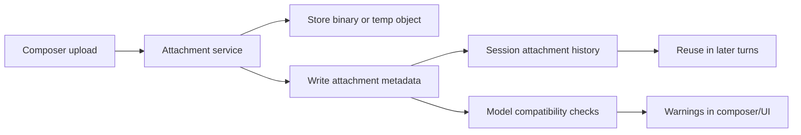

# Multimodal Attachments

## Executive Take

pi already has enough attachment primitives to support image-bearing prompts, but a desktop-class frontend needs a lot more than inline base64.

For this project, v1 attachment handling should support:
- chat composer uploads
- per-session attachment history
- attachment metadata and status
- model-compatibility warnings
- reuse of prior session attachments without forced re-upload where possible

## Main Findings

### 1. Current pi support is primitive but usable

pi RPC already supports image-bearing prompts and session message structures that can carry attachments. That is enough for a first end-to-end path.

What it does **not** give you automatically:
- attachment history UI
- upload lifecycle tracking
- object storage / resumable upload
- validation and normalization pipeline
- model capability checks

### 2. Session-scoped attachment history is the right abstraction

You explicitly requested per-session attachment history, and the research supports that.

The product should distinguish between:
- **message attachment**: attached to one turn
- **session attachment**: retained as an artifact in this conversation/workspace

That avoids the common UX bug where an uploaded file disappears into transcript history and becomes hard to reuse.

### 3. Attachment state needs to be explicit

Recommended states:
- `pending`
- `uploading`
- `attached`
- `processing`
- `ready`
- `failed`
- `removed`

Those states should be visible in UI rather than inferred.

### 4. Model constraints should be surfaced in product, not hidden in failure paths

Different backends support different modalities, sizes, and counts. The frontend should warn early when:
- current model cannot use the attached file type
- the file exceeds size limits
- the file may upload but not be meaningfully consumable by the current backend

### 5. Base64-only is fine for prototype plumbing, not the final architecture

For small images and an early milestone, inline/base64 transport can prove the stack.

For a serious desktop-class product, the better architecture is object-backed uploads with metadata records.

## Recommended Architecture

## Suggested v1 Data Model

| Field | Purpose |
|---|---|
| `attachment_id` | stable identifier |
| `session_id` | session ownership |
| `message_id` | optional first-use linkage |
| `file_name` | display |
| `mime_type` | compatibility checks |
| `size_bytes` | limit checks |
| `kind` | image/pdf/audio/document/other |
| `status` | pending/ready/failed/etc |
| `storage_ref` | path or object key |
| `preview_ref` | thumbnail or preview source |
| `extracted_text` | optional OCR/transcript summary |
| `created_at` | sorting/history |
| `last_used_at` | reuse UX |
| `error` | failure explanation |

## Recommended UX

### Composer
- drag/drop or picker
- visible chips/cards for pending attachments
- remove button before send
- compatibility warnings against selected model

### Session shelf
- right-side or lower panel listing prior attachments
- filters by type/status
- quick reattach action
- provenance showing first message/tool context where it appeared

### Transcript
- each message shows exactly which attachments were used
- images preview inline
- non-image files show clear icon + metadata + open/preview action

## Suggested rollout

### Milestone 1
- image upload from composer
- send to pi/model path
- per-session history for uploaded items
- basic readiness/error states

### Milestone 2
- broader file types
- metadata extraction
- compatibility warnings by provider/model
- preview improvements

### Milestone 3
- resumable upload / object storage
- dedupe/reuse across sessions or workspaces if desired

## Source References

### Local docs / code
- `/home/mobrienv/.npm-global/lib/node_modules/@mariozechner/pi-coding-agent/docs/rpc.md`
- `/home/mobrienv/.npm-global/lib/node_modules/@mariozechner/pi-coding-agent/docs/session.md`
- `/home/mobrienv/projects/rho/web/public/js/chat/chat-input-and-rpc-send.js`

### Official web sources
- https://developers.openai.com/api/docs/guides/file-inputs
- https://platform.openai.com/docs/api-reference/uploads/create
- https://developers.openai.com/api/docs/guides/retrieval
- https://developers.openai.com/api/docs/guides/chatkit
- https://docs.anthropic.com/en/docs/build-with-claude/files
- https://docs.anthropic.com/en/docs/build-with-claude/citations
- https://ai.google.dev/api/files
- https://owasp.org/www-community/vulnerabilities/Unrestricted_File_Upload

## Connections

- [[../idea-honing.md]]
- [[README.md]]
- [[pi-integration-surface.md]]
- [[codex-desktop-benchmark.md]]
- [[liveview-pwa-patterns.md]]
- [[terminal-embedding-libghostty.md]]
- [[openclaw-inspired-rho-runtime-dashboard]]
- [[small-improvement-rho-dashboard]]
