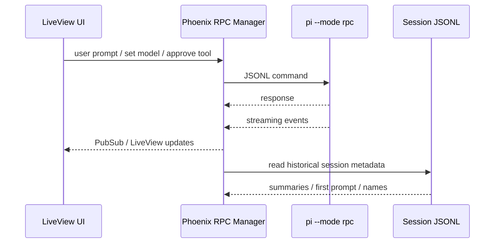

# pi Integration Surface

## Why this matters

If this frontend is a separate Phoenix app, the quality of the product is mostly determined by how cleanly it can drive pi without in-process coupling. The good news: pi's RPC mode is already explicit enough to support this.

## Main Findings

### 1. RPC is the right primary boundary

pi exposes a strict JSONL RPC mode over stdin/stdout via:

```bash
pi --mode rpc
```

Important properties:
- commands go to stdin as JSON objects
- responses and events come back on stdout as JSON lines
- framing is **LF-only**; generic line readers that split on Unicode separators are wrong here
- long-running work is represented as **streaming events**, not blocking responses

Relevant local docs:
- `/home/mobrienv/.npm-global/lib/node_modules/@mariozechner/pi-coding-agent/docs/rpc.md`
- `/home/mobrienv/.npm-global/lib/node_modules/@mariozechner/pi-coding-agent/docs/session.md`

### 2. The frontend should treat session processes as managed resources

The Phoenix app should own a per-session or per-active-connection process manager that:
- spawns `pi --mode rpc`
- tracks process health
- routes commands to the correct session
- buffers/replays recent events for reconnects
- tears down or parks idle sessions cleanly

rho's existing web layer already demonstrates the shape of this:
- `web/rpc-manager.ts`
- `web/server-rpc-ws-routes.ts`
- `web/public/js/chat/rpc-reconnect-runtime.js`
- `web/public/js/chat/rpc-session-routing.js`

### 3. pi already exposes the event model needed for a desktop UI

The key event families are:
- `message_start` / `message_update` / `message_end`
- `tool_execution_start` / `tool_execution_update` / `tool_execution_end`
- `agent_start` / `agent_end`
- `extension_ui_request`

That is enough to drive:
- streaming assistant text
- streaming thinking blocks
- tool-call timeline
- live tool output panels
- approval / confirmation modals
- notifications and status widgets

One important detail: `tool_execution_update.partialResult` is cumulative, so the UI should **replace** visible tool output, not append blindly.

### 4. Session listing does not require live RPC

pi sessions are JSONL files on disk. A frontend can list and summarize past sessions by reading session files directly rather than waking live pi processes.

This is useful for:
- fast session lists
- search / resume flows
- project/worktree history views
- recent-session previews

Useful local references:
- `docs/session.md`
- `web/session-reader-api.ts`

### 5. Approvals map cleanly onto the extension UI sub-protocol

pi already supports extension-driven confirmation flows in RPC mode through `extension_ui_request` and `extension_ui_response`.

That means the LiveView app does **not** need to invent a separate approval protocol first. It can:
- render confirm/select/input/editor dialogs from `extension_ui_request`
- return structured answers with `extension_ui_response`
- preserve pi's existing semantics as requested in requirements

### 6. Command discovery is available

`get_commands` exposes extension commands, prompt templates, and skills. That is enough to build:
- a slash-command picker
- command palette integration
- discoverable skill UIs

### 7. Current pi attachment support is image-forward, not full asset-management

RPC prompt payloads already support image content blocks, and session files carry attachment structures. But pi does not by itself provide a full session attachment management layer. That belongs in the new frontend/backend architecture.

## Recommended Phoenix Boundary



## Concrete Design Implications

1. **Use RPC for live control and disk reads for history.** Don't conflate the two.
2. **Normalize everything by frontend session id + rpc session id + session file path.** You will need all three.
3. **Build a replay-capable event buffer in Phoenix.** Reconnects are normal, especially for installed PWAs.
4. **Keep expensive rendering off the hot path.** Stream plain text first; do heavy markdown/highlighting after `message_end`.
5. **Mirror pi's approval semantics, don't redesign them yet.** The product requirement already points that way.

## Risks

- Too many long-lived pi subprocesses if each open session stays fully hot.
- UI inconsistency if session history is read from disk but live state is only in memory.
- Poor streaming performance if LiveView rerenders the whole thread on every token or tool-output update.

## Source References

### Local docs
- `/home/mobrienv/.npm-global/lib/node_modules/@mariozechner/pi-coding-agent/README.md`
- `/home/mobrienv/.npm-global/lib/node_modules/@mariozechner/pi-coding-agent/docs/rpc.md`
- `/home/mobrienv/.npm-global/lib/node_modules/@mariozechner/pi-coding-agent/docs/session.md`

### Local implementation references
- `/home/mobrienv/projects/rho/web/rpc-manager.ts`
- `/home/mobrienv/projects/rho/web/server-rpc-ws-routes.ts`
- `/home/mobrienv/projects/rho/web/session-reader-api.ts`
- `/home/mobrienv/projects/rho/web/public/js/chat/chat-rpc-event-routing.js`
- `/home/mobrienv/projects/rho/web/public/js/chat/chat-streaming-parts.js`
- `/home/mobrienv/projects/rho/web/public/js/chat/rpc-session-routing.js`

## Connections

- [[../idea-honing.md]]
- [[README.md]]
- [[codex-desktop-benchmark.md]]
- [[liveview-pwa-patterns.md]]
- [[terminal-embedding-libghostty.md]]
- [[multimodal-attachments.md]]
- [[small-improvement-rho-dashboard]]
- [[rho-dashboard-improvements-2026-02-14]]
- [[rho-dashboard-improvements-2026-02-15-16]]
