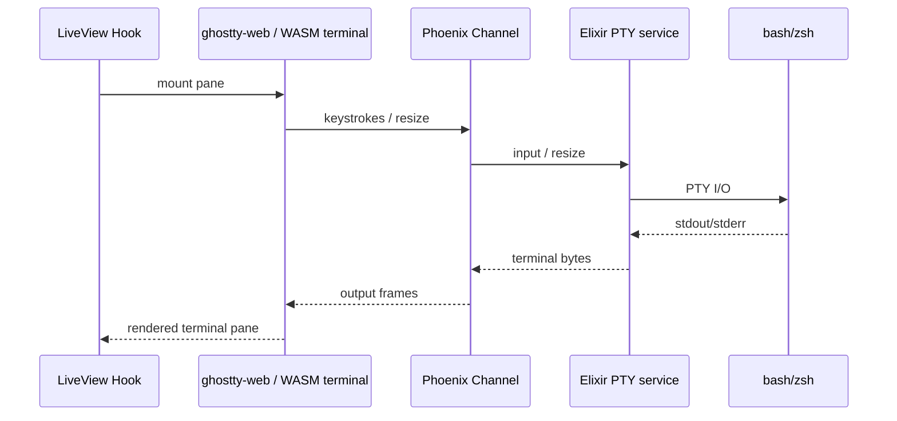

# Terminal Embedding via libghostty

## Executive Take

Embedded first-class terminal panes are feasible, but **libghostty is not yet a polished embeddable terminal SDK**. Today the practical path is:

- browser-side terminal engine / renderer using `libghostty-vt`-adjacent tooling or `ghostty-web`
- Phoenix Channel transport for terminal I/O
- server-side PTY management in Elixir

So: yes, this is buildable. No, it is not a clean “drop libghostty into Phoenix” story yet.

## Main Findings

### 1. libghostty exists, but the stable public embedding surface is still early

The currently real public piece is `libghostty-vt`, a lower-level VT parser/state engine. The broader embeddable `libghostty` story is still emerging.

Practical implication: do not base the whole product on the assumption that Ghostty already ships a fully stable cross-platform pane widget.

### 2. A browser/webview app still needs server-side PTYs

Because this product is a PWA/local web app, terminal panes cannot own OS PTYs directly in the browser. The architecture must split:
- **server side**: PTY + shell lifecycle
- **client side**: terminal rendering + input capture
- **transport**: Phoenix Channel or equivalent websocket path

### 3. The best near-term architecture is WASM terminal frontend + Channel transport

This matches the current state of the ecosystem better than trying to bind an unfinished native embedding API into a PWA shell.

### 4. The risks are real

Key risks:
- Ghostty embedding API churn
- websocket latency and resize thrash
- PTY cleanup / zombie processes
- browser clipboard / mouse limitations
- terminal escape-sequence security issues

These are manageable, but they argue for a staged rollout.

## Recommended Architecture for this Project

### v1 terminal stack

- **Client**: LiveView hook mounts a web terminal implementation compatible with Ghostty's current practical surface
- **Server**: Elixir PTY manager per terminal session
- **Transport**: Phoenix Channel per terminal pane or per workspace session
- **Lifecycle**: explicit create / focus / resize / detach / destroy events

### Recommended operational model

- one primary terminal pane per session at first
- terminals scoped to active worktree / workspace
- pane state persisted at the app level, shell state persisted in PTY process lifetime
- clear “disconnected / terminated / reconnecting” states

## Good Product Constraint

Treat terminal panes as part of the app's **workspace runtime**, not as generic tabs. That keeps the product aligned with your requirements:
- agent session
- worktree context
- chat + tools + files + terminal all tied together

## Risks and Mitigations

| Risk | Why it matters | Mitigation |
|---|---|---|
| libghostty API churn | breakage across upgrades | vendor/pin known-good build |
| websocket latency | terminal feels mushy | local-first default, debounce resize, keep PTY local |
| PTY leaks | zombie shells chew resources | supervision tree + idle timeout + explicit pane teardown |
| browser fidelity gaps | clipboard/mouse weirdness | limit initial feature set and document it |
| escape sequence abuse | terminal can be a hostile output surface | sanitize dangerous sequences where appropriate |

## Recommended implementation stance

I would not make “native libghostty embedding purity” a hard blocker.

The smart move is:
1. ship an embedded pane architecture that works in the browser/PWA model,
2. keep the abstraction boundary clean,
3. swap terminal implementation details later as libghostty matures.

## Source References

### Primary
- https://github.com/ghostty-org/ghostty
- https://mitchellh.com/writing/libghostty-is-coming
- https://raw.githubusercontent.com/ghostty-org/ghostty/main/include/ghostty/vt.h
- https://raw.githubusercontent.com/ghostty-org/ghostty/main/include/ghostty/vt/wasm.h
- https://github.com/coder/ghostty-web
- https://hexdocs.pm/phoenix/channels.html
- https://hexdocs.pm/phoenix_live_view/1.1.1/js-interop.html
- https://github.com/alchemist-camp/netrunner
- https://xtermjs.org/docs/guides/security/

### Related local/vault note
- [[libghostty-embedding-phoenix]]

## Connections

- [[../idea-honing.md]]
- [[README.md]]
- [[pi-integration-surface.md]]
- [[codex-desktop-benchmark.md]]
- [[liveview-pwa-patterns.md]]
- [[multimodal-attachments.md]]
- [[libghostty-embedding-phoenix]]
- [[small-improvement-rho-dashboard]]
