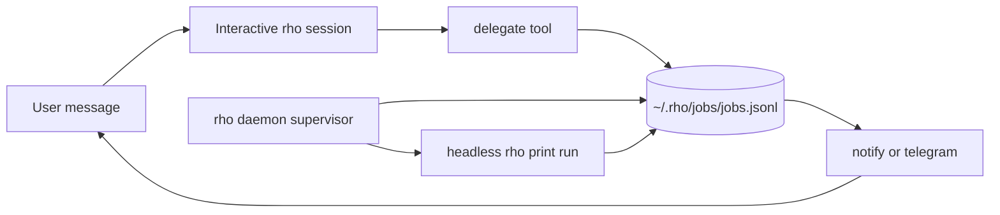

# Unblocked work for Rho

Date: 2026-09-23
Status: design, not implemented

## Overview

Rho's interactive session does the job inside the turn. `rho_subagent` only opens a Herdr pane. Brain tasks are a checklist, not a runner. Heartbeat is a separate prompt, not a way to get long work out of the chat.

Muse keeps the main thread free by splitting conversation from durable work. The chat answers or hands off. A worker outside the turn owns the job, pauses when it needs the user, and notifies only when the result matters or the job is stuck. It does not invent jobs, and it does not spawn a swarm to clear a blockage.

Rho should copy that split. It should not copy Ideas, Goals, side chats, or prompt-only "please delegate."

## Lanes



| Lane | Owns | Must not |
| --- | --- | --- |
| Chat | The open `rho` session. Answers, clarifies, calls `delegate`, stops. | Run a multi-step job. Poll a job. Open a Herdr pane unless the user asked to watch. |
| Work | `rho` daemon supervisor. Leases queued jobs and runs them headless. | Inject itself into the chat turn. Fall back to the interactive session if the daemon is down. |
| Notice | Delivery. UI notice, and Telegram only when policy allows. | Wake a model turn for an ordinary success. |

`rho_subagent` stays the visible pane. `delegate` is the hidden job. They are not interchangeable.

## What gets delegated

Delegate only a job the user asked for, or a due reminder whose text is already an agent job.

A job has a done condition and more than one step, or it must survive the session closing. Examples: "fix the failing test and report", "import this directory and summarize", "watch this reminder by actually doing it".

Answer in the chat when the turn is a question, a lookup, a one-step edit, or a clarification. Do not delegate those.

Do not delegate because the turn is slow, the model is unsure, or the checklist looks stale. That is the swarm behavior this design rejects.

## Job record

Path: `~/.rho/jobs/jobs.jsonl`. Append-only, same event style as brain. Not a brain entry. Jobs are too large and too volatile to inject, and brain tasks already mean "human checklist item."

Folded job:

| Field | Values |
| --- | --- |
| `id` | `job-` plus a short id |
| `title` | short label |
| `prompt` | the handed-off instruction |
| `cwd` | directory the runner uses |
| `status` | `queued`, `running`, `waiting_input`, `succeeded`, `failed`, `cancelled` |
| `question` | set only while `waiting_input` |
| `result` | final text, capped |
| `error` | failure text |
| `createdAt`, `updatedAt` | ISO |
| `leaseUntil`, `leasePid` | supervisor lease |
| `notify` | `pending`, `sent`, `suppressed` |

No plan tree, evidence list, or approval object in the first version. A runner that needs a destructive confirmation writes `waiting_input` with the question. Existing email and Telegram gates still apply inside the runner.

Idempotency: if a `queued` or `running` job has the same normalized title and prompt, `delegate` returns that id and does not enqueue another.

## Chat contract

New tool on the Rho extension: `delegate`.

```text
delegate title="Fix the rho CLI test" prompt="..." cwd="/home/mobrienv/.workspace/rho-v2"
```

It appends the job and returns `{ id, status: "queued" }` or `{ id, status: "queued", daemon: "down" }`. It does not start the runner inside the tool call.

The tool result tells the model to reply with the id and stop. The system prompt repeats that, because a tool description alone will be ignored:

- You are the conversation.
- A requested multi-step job goes to `delegate`, then you stop.
- Do not poll `job`.
- Do not use `rho_subagent` unless the user asked for a visible pane.
- If the daemon is down, say the job is queued until `rho start`. Do not do the job yourself.

`before_agent_start` adds a short Work section, not the job list:

```text
## Work
1 running. 1 waiting for you: job-12 "which file?".
Delegate multi-step jobs. Do not poll.
```

Cap that section at a handful of `waiting_input` lines. Full history is `job action=list`.

Second tool: `job`.

| Action | Effect |
| --- | --- |
| `list` | Folded status, newest first |
| `show` | One job, including result or question |
| `reply` | Append the user's answer and set `queued` if status was `waiting_input` |
| `cancel` | Set `cancelled`. Supervisor kills the lease pid if it still owns it |
| `attach` | Open the transcript in a Herdr pane. Does not move ownership into the chat |

`reply` is explicit. A normal chat message is not assumed to answer the pending job. The main agent may call `job action=reply` only when the user is clearly answering that question.

## Supervisor

The rho daemon owns the loop. The interactive session must not.

- Poll every few seconds.
- Slot count comes from the machine, not a fixed 1. Leave one core for the interactive session. Each running job reserves 1 GiB. Also leave the larger of 1 GiB or 15% of total memory. If free memory cannot cover one job, start nothing and leave work queued. `RHO_JOB_SLOTS` overrides the formula.
- A live pid is the lease. A running job whose pid is dead after a daemon restart is failed, not restarted blindly.
- Runner is a headless print run: `RHO_SUBAGENT=1`, no Herdr pane, no session attach. Working directory is the job `cwd`.
- The runner's prompt is the job prompt plus: write a result and exit; if you need the user, emit a single question and stop; do not message Telegram yourself.
- On process exit 0 with a result marker, status becomes `succeeded`. Non-zero or a missing marker becomes `failed`. A question marker becomes `waiting_input` and the process is allowed to exit. Resume only after `reply`.
- Closing the interactive session does not cancel a lease. `rho stop` cancels running jobs and leaves `queued` jobs on disk.
- If the daemon is not running, jobs remain `queued`. Chat does not become the worker.

Heartbeat stays a check-in. It may call `delegate` for a due reminder that says to do agent work. It must not run that work inside the heartbeat turn. Ordinary reminder bookkeeping stays as it is.

## Notice

Use the interrupt policy already specified for proactive preferences. Enforce it in the supervisor, not in the runner's prompt.

| Event | `normal` | `quiet` | `eager` |
| --- | --- | --- | --- |
| `succeeded` / `failed` | UI notice if a session is open. Telegram only if no session is open. | Record only, unless the job was tagged urgent | Same as normal, and a session may also get one line |
| `waiting_input` | Always surface. This is a blocker, not a status ping | Always surface | Always surface |
| empty heartbeat | unchanged | unchanged | unchanged |

Quiet hours suppress success and failure delivery. They do not suppress `waiting_input`.

Do not start a model turn to announce success. `ctx.ui.notify` is enough when the session is open. Telegram is the out-of-session path. `show_ok` does not apply to jobs.

## What this does not do

- No client-side follow-up queue. Pi and Herdr already let the user type during a turn. Delegation is what frees the model, not the keyboard.
- No automatic routing of the next chat message into a paused job.
- No Ideas tab, goal tree, page monitor, or side chat.
- No `sessions_spawn` swarm and no `delegationMode: prefer` as the mechanism. Prompt guidance without a worker is how the main thread stays blocked.
- No change to brain tasks. A job is not a task. A task can later cause a job, but the checklist remains the checklist.
- No second writer in `brain.jsonl`.

## Errors

- Daemon down at delegate time: job is `queued`, tool result says so, chat does not execute it.
- Runner crash: `failed` with the exit text, lease cleared, next queued job may start.
- Duplicate delegate: return the existing id.
- `reply` on a job that is not `waiting_input`: tool error, no write.
- `attach` while the runner is live: open a read-only transcript view, do not send keys into the print process.
- Cancel during `running`: mark `cancelled`, then kill the leased pid. A late result from that pid is ignored.

## Tests

- `delegate` returns without starting a process inside the tool call.
- A second identical `delegate` while `queued` returns the same id.
- Supervisor with a fake runner moves `queued` to `running` to `succeeded` and does not touch the interactive session.
- `waiting_input` does not start the next job, and `reply` queues it again.
- Quiet hours suppress a success Telegram and still emit `waiting_input`.
- Daemon-down result does not contain a fallback instruction to do the work inline.
- `rho_subagent` is not called by the supervisor.

## First increment

Ship `delegate`, the job log, and a daemon supervisor whose slot count follows spare cores and free memory. Notification is UI-only until Telegram policy is wired. Do not build `attach` until a job can be inspected with `job action=show`.

## Connections

- Prior interrupt-policy notes: `../2026-09-23-workspace-state/design/detailed-design.md`
- Current pane launcher: `extensions/rho/index.ts` `rho_subagent`
- Daemon: `cli/daemon-core.ts`
- OpenMuse split: chat `delegate_task` writes a record; `TaskWorker` polls outside the turn
- OpenClaw contrast: `delegationMode: prefer` is prompt-only and is not this design
