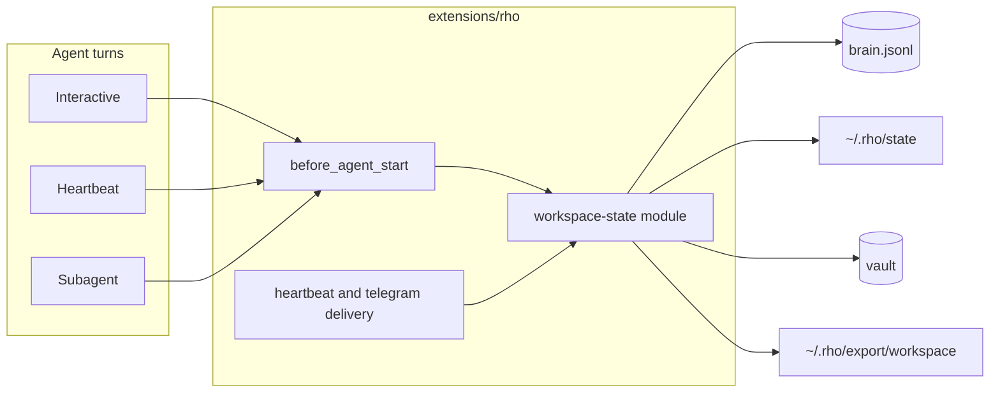

# Workspace state for Rho

Date: 2026-09-23
Status: design, not implemented

## Overview

The phone "System Files" screen is a Muse/OpenClaw workspace: markdown files the agent is expected to load every session. Rho already deleted that pattern. `brain.jsonl` is the source of truth for short durable facts, the vault holds long linked notes, and heartbeat owns periodic turns. Putting `SOUL.md` back as an authority would split memory again.

This design adds one module to the existing Rho extension, not a new Pi extension and not a new store. It names each Muse/OpenClaw file, maps it onto a Rho store, and defines how interactive agents, heartbeats, and subagents read and write it.

`user/` and `workspace/` on that screen are the agent's computer directories. They are not persona state. Do not import them into brain.

## What the files actually are

Sources: [OpenClaw agent workspace](https://docs.openclaw.ai/concepts/agent-workspace), [system prompt](https://docs.openclaw.ai/concepts/system-prompt), [heartbeat](https://docs.openclaw.ai/gateway/heartbeat), [OpenMuse](https://github.com/CopilotKit/OpenMuse) `packages/domain/src/agent.ts`.

| File | Role there | Lifetime | Rho today |
| --- | --- | --- | --- |
| `AGENTS.md` | Operating instructions. Does not enable tools. | Every session, including subagents | Meta prompt plus behaviors. No long operating doc. |
| `SOUL.md` | Persona, tone, boundaries | Every full session | Short `behavior` lines only |
| `IDENTITY.md` | Name, vibe, emoji | Every full session | `init.toml` name plus `identity` keys |
| `USER.md` | Stable user directives | Every full session, own budget, not subagents | `user` and `preference` entries |
| `TOOLS.md` | Local tool conventions. Guidance only. | Full sessions | Tool list in the meta prompt. No local conventions doc. |
| `HEARTBEAT.md` | Tiny checklist for the periodic turn | Heartbeat user message only. Not a normal system-prompt section. | `heartbeat-prompt.txt`, reminders, `rho-state.json` |
| `MEMORY.md` | Curated long-term memory. Main private session only. | Injected if short; otherwise search | Learnings under a prompt budget. Vault for the rest. |
| `memory/YYYY-MM-DD.md` | Daily log. Read today and yesterday on demand. | Not fully injected | Missing |
| `BOOTSTRAP.md` | One-time first-run ritual. Deleted after. | Until complete | Missing |
| `PROACTIVE_PREFERENCES.md` | When the agent may interrupt. Muse-specific; OpenClaw encodes the same idea as heartbeat visibility, active hours, and `showChatUpdates`. | Policy, not prose | Missing. Heartbeat always runs its prompt. |

OpenMuse does not use these files. It stores the same ideas as records: `identity` (name, tone, avatar, `showChatUpdates`), `memories[]`, `goals`, `monitors`, `ideas`, `tasks`, `notifications`. OpenClaw injects markdown and truncates it (`bootstrapMaxChars` 20k, total 60k). Rho should follow OpenMuse's record model and OpenClaw's injection rules.

## Decision

Canonical state stays where it is.

- Short facts, identity keys, user keys, preferences, tasks, reminders: `~/.rho/brain/brain.jsonl`
- Long reference: `~/.rho/vault`
- Heartbeat schedule and leadership: `~/.rho/rho-state.json`
- Long-form documents that do not fit a brain line: `~/.rho/state/*.md`

Markdown under `~/.rho/state/` is a human-editable view of those documents, written and read by one module. Rendered Muse filenames under `~/.rho/export/workspace/` are generated. Agents do not edit the export. A direct edit to `~/.rho/state/` is an import event, not a silent second write path.

Do not watch a phone dump and continuously merge it. Import is explicit.

## Architecture

Lives in `extensions/lib/workspace-state.ts`, called from `extensions/rho/index.ts`. A sibling Pi extension would race the existing `before_agent_start` injection. Rho's `index.ts` is already large; the logic stays in the lib, and the extension only registers the tool, command, and hook.

## Document classes

| Class | State file | Muse export name | Store |
| --- | --- | --- | --- |
| `operating` | `state/operating.md` | `AGENTS.md` | file |
| `persona` | `state/persona.md` | `SOUL.md` | file |
| `identity` | brain `identity` keys: `name`, `vibe`, `emoji` | `IDENTITY.md` | brain |
| `user` | brain `user` keys plus `state/user.md` for prose that exceeds a line | `USER.md` | brain, file overflow |
| `tools` | `state/tools.md` | `TOOLS.md` | file |
| `checklist` | `state/checklist.md` | `HEARTBEAT.md` | file |
| `proactive` | brain `preference` category `Proactive`, keys below | `PROACTIVE_PREFERENCES.md` | brain |
| `memory` | learnings plus vault | `MEMORY.md` | brain, vault |
| `daily` | `state/memory/YYYY-MM-DD.md` | `memory/YYYY-MM-DD.md` | file, not injected whole |
| `bootstrap` | `state/bootstrap.md`, absent after ritual | `BOOTSTRAP.md` | file |

`TOOLS.md` never changes which tools exist. Tool policy stays in extension registration.

### Proactive preferences

These are enforced by delivery code. The prompt only repeats them so the model stops asking.

| Key | Values | Default | Enforced by |
| --- | --- | --- | --- |
| `interrupt` | `quiet`, `normal`, `eager` | `normal` | heartbeat delivery |
| `show_ok` | bool | false | suppress `RHO_OK` notices |
| `show_alerts` | bool | true | telegram and desktop notify |
| `background_updates` | bool | false | OpenMuse `showChatUpdates` |
| `quiet_hours` | `HH:MM-HH:MM` plus timezone | unset | heartbeat scheduler |
| `ideas` | `suggest`, `silent` | `silent` | heartbeat may not invent check-ins |

`quiet` means heartbeat still runs internal maintenance (due reminders) but does not message the user unless a reminder is tagged `urgent`. `eager` allows a daytime check-in when the checklist says so. `normal` is today's behavior: alert or `RHO_OK`.

Quiet hours belong in the scheduler, not in a prompt the model can ignore.

## Injection

`before_agent_start` already appends meta prompt, bootstrap, and brain. Add one bounded **Workspace** section after brain, built by the same module.

| Turn | Inject | Do not inject |
| --- | --- | --- |
| Interactive main | operating, persona, identity, user, tools note, memory summary, proactive policy, bootstrap if pending | checklist, daily logs |
| Heartbeat | checklist appended to the heartbeat user message, not the system prompt. Light mode skips operating/persona/user/memory. | full vault |
| Subagent | operating only, truncated | persona, user, memory, proactive, checklist |

Budgets, OpenClaw-shaped but smaller because Rho already injects brain:

- per file: 8_000 chars
- workspace section total: 16_000 chars
- user prose: 4_000 chars, separate from the file cap
- truncation marker names the class and says to call `workspace action=get`

Missing files inject nothing. Do not inject a "missing file" line. Rho is not mid-onboarding unless `bootstrap.md` exists.

`MEMORY.md` content in the prompt is the already-budgeted brain prompt. The export file is a render of that plus pointers to vault notes. Do not paste the vault into the prompt.

Daily logs: the prompt says today's and yesterday's paths exist if the files do. The agent reads them with the workspace tool. No automatic include.

## How agents interact

One tool, `workspace`, on the Rho extension.

| Action | Who | Effect |
| --- | --- | --- |
| `get` | any | Return one class, or `list` |
| `set` | main, heartbeat for `checklist` only | Replace that document or proactive keys. Appends a brain event when the class is brain-backed. |
| `append_daily` | main, heartbeat | Append a dated line. Does not edit `MEMORY`. |
| `render` | main | Regenerate `~/.rho/export/workspace/` |
| `import` | main | Read a Muse/OpenClaw directory once. Report the mapping. Write nothing until `apply=true`. |
| `complete_bootstrap` | main | Delete `bootstrap.md` after identity, user, and persona are non-empty |

Rules the prompt states and the tool enforces:

- Subagents cannot `set` persona, user, memory, or proactive keys.
- Heartbeat cannot `set` operating, persona, or user. It may replace `checklist` and append a daily line.
- Recurring work is a reminder (`brain action=add type=reminder`). Writing a schedule into `checklist.md` is rejected with that instruction.
- Persona and operating edits do not change tool availability.
- A proactive change is a brain write. The next heartbeat reads it from brain, not from the export file.
- If the user edits `~/.rho/state/*.md` in an editor, the next `get` sees it. Export files are overwritten on `render` and are not read back.

Slash command `/workspace` is the same surface for the human: `show`, `render`, `import <path>`.

### Use cases

1. **Session start.** User does not restate name, tone, or standing rules. The main agent sees them in Workspace. A subagent sees operating rules only, so a delegated coding task does not inherit private user notes.
2. **Correction.** "Don't ping me at night." Main agent writes `quiet_hours`. Delivery code skips telegram inside the window even if the model wants to notify.
3. **Heartbeat.** Leader session sends the checklist as the user message. Empty or heading-only checklist skips the model call, matching OpenClaw's empty-scratch skip. Due reminders still run.
4. **Quiet morning.** `interrupt=quiet` and no urgent reminder: maintenance only, no `RHO_OK` toast when `show_ok` is false.
5. **Import.** User points at a dumped Muse workspace. Dry-run prints `SOUL.md` → `state/persona.md`, `USER.md` → user keys plus `state/user.md`, `HEARTBEAT.md` → `state/checklist.md`, `PROACTIVE_PREFERENCES.md` → proactive keys, `MEMORY.md` → learning candidates over 200 chars go to a vault note. `apply=true` writes. Export files are not a sync target.
6. **Phone-shaped export.** `render` writes the nine filenames so a file browser matches the screenshot. Editing those copies does nothing until a later explicit import.
7. **First run.** If `state/bootstrap.md` exists, the main agent runs that ritual, fills identity and persona, then `complete_bootstrap`. The file is not recreated.
8. **Daily note.** End of a useful session appends to `state/memory/YYYY-MM-DD.md`. Consolidation may later promote a line into a learning. The daily file is never the curated memory.

## Import mapping

| Source | Destination | Reject |
| --- | --- | --- |
| `SOUL.md` | `state/persona.md` | secrets-looking lines (key, token, pem) |
| `AGENTS.md` | `state/operating.md` | tool-enablement claims; kept as prose but a warning is returned |
| `IDENTITY.md` | identity keys parsed from `name`, `vibe`, `emoji` headings or `Key: value` lines | extra keys ignored |
| `USER.md` | short directives become `user` or `preference`; remainder `state/user.md` | — |
| `TOOLS.md` | `state/tools.md` | — |
| `HEARTBEAT.md` | `state/checklist.md` | `tasks:` schedule blocks; tell the user to make reminders |
| `PROACTIVE_PREFERENCES.md` | proactive keys, unknown keys kept as preference text | — |
| `MEMORY.md` | lines ≤200 chars become learning candidates; rest becomes vault note `imported-memory` | duplicate learnings skipped |
| `memory/*.md` | copied to `state/memory/` | — |
| `BOOTSTRAP.md` | `state/bootstrap.md` only if identity is empty | — |
| `user/`, `workspace/` | not imported | reported as computer files |

Import is not continuous sync. A second import is dry-run by default and shows diffs.

## Error handling

- Missing `~/.rho/state`: create on first `set` or `rho init`. Do not fail session start.
- Unreadable file: skip that class, notify once, continue with brain.
- Over budget: truncate with a marker. The file on disk is unchanged.
- Concurrent `set`: file lock already used for brain. State files use the same `withFileLock` on a `state.lock`.
- Import with no recognized files: error, write nothing.
- Subagent `set` on a forbidden class: tool error, no write.
- Checklist that is only headings: heartbeat skips the model call and records `skipped: empty-checklist`.

## Testing

- Class filter: subagent prompt contains operating and not persona, user, or checklist.
- Heartbeat prompt path: checklist is on the user message, absent from `before_agent_start` system prompt.
- Empty checklist skips the model call without clearing due reminders.
- `quiet_hours` blocks telegram delivery inside the window and allows an `urgent` reminder through.
- Import dry-run writes nothing. `apply=true` is idempotent on a second run.
- `TOOLS.md` import does not register a tool.
- Truncation marker appears when persona exceeds 8_000 chars, and `get` returns the full file.
- Export render is deterministic and gitignores nothing under `~/.rho` that is already private.

## What this does not do

- No bidirectional sync with a live Muse or OpenClaw install.
- No per-agent roster. One Rho identity. A later `agentId` can add `state/agents/<id>/` without changing the tool.
- No replacement of vault search, skills, or the brain budget.
- No computer sandbox for `user/` and `workspace/`. That is OpenMuse's container, not this extension.

## Alternatives rejected

- **Markdown as source of truth.** Rho already migrated off `SOUL.md` / `AGENTS.md` / `HEARTBEAT.md`. Two writers will drift.
- **New Pi extension.** It cannot cleanly own injection without ordering bugs against `extensions/rho`.
- **Stuff long persona text into brain lines.** Brain's contract is short, ranked, decaying facts. A soul document is not that.
- **Inject every file every turn, including heartbeat and daily logs.** OpenClaw stopped doing that because it dominates the cache and leaks into subagents.

## Connections

- Rho brain: `docs/brain.md`
- Current injection: `extensions/rho/index.ts` `before_agent_start`
- OpenClaw: https://docs.openclaw.ai/concepts/agent-workspace
- OpenMuse agent records: https://github.com/CopilotKit/OpenMuse `packages/domain/src/agent.ts`
