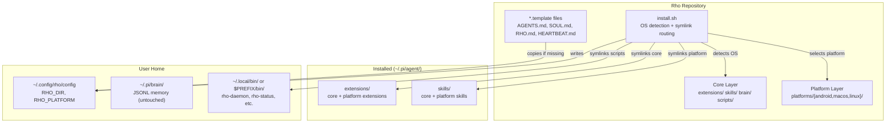
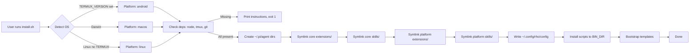

# Cross-Platform Rho — Design Document

## Overview

Restructure Rho so the core framework (heartbeat, memory, check-ins) runs on macOS, Linux, and Android/Termux, with platform-specific capabilities (notifications, clipboard, UI automation) provided as optional layers. The repo stays as a single repository; the install script detects the OS and symlinks the right pieces.

This is a structural refactor, not a feature rewrite. The core extensions and skills are already platform-agnostic. The work is: reorganize platform-specific code into a `platforms/` directory, create equivalent skills for macOS and Linux, and make the install script OS-aware.

---

## Detailed Requirements

### Audience
- **Primary:** The maintainer, running Rho on personal Mac, Linux, and Android devices.
- **Secondary:** Other developers installing Rho as a general-purpose persistent agent framework.

### Core Principles
1. Each Rho instance is independent — own brain, heartbeat, personality. No shared state in v1.
2. Tmux is the universal interaction model across all platforms.
3. Single repo, no separate packages. Install script picks the right pieces.
4. Minimal disruption to existing repo structure. Add `platforms/`, move Android-specific code there, keep everything else in place.
5. Desktop install is check-and-bail (verify deps, print instructions). Termux bootstrap stays hands-on.

### Acceptance Criteria
1. `git clone` + `./install.sh` works on a fresh macOS, Linux, and Termux machine
2. `rho-daemon` starts a tmux session with a working heartbeat on all three platforms
3. Core extensions (rho.ts, brain.ts, brave-search.ts, memory-viewer, moltbook-viewer, usage-bars) work on all platforms
4. Platform skills (notification, clipboard, open-url) are available and functional on each platform
5. Existing Termux setup migrates cleanly by re-running `install.sh`
6. Tasker extension + Android-only skills only appear on Android installs
7. README updated with cross-platform install instructions and platform-specific sections
8. Repo restructure doesn't break existing tests or CI

---

## Architecture Overview



### Data Flow: Install



---

## Components and Interfaces

### 1. Repository Structure (Post-Refactor)

```
rho/
├── extensions/                    ← core (always installed)
│   ├── brain.ts
│   ├── brave-search.ts
│   ├── memory-viewer.ts
│   ├── moltbook-viewer.ts
│   ├── rho.ts
│   └── usage-bars.ts
├── skills/                        ← core (always installed)
│   ├── code-assist/SKILL.md
│   ├── pdd/SKILL.md
│   ├── rho-validate/SKILL.md
│   └── update-pi/SKILL.md
├── platforms/
│   ├── android/
│   │   ├── extensions/
│   │   │   └── tasker.ts          ← moved from extensions/
│   │   ├── skills/
│   │   │   ├── clipboard/SKILL.md ← renamed from termux-clipboard
│   │   │   ├── contacts/SKILL.md  ← renamed from termux-contacts
│   │   │   ├── device/SKILL.md    ← renamed from termux-device
│   │   │   ├── dialog/SKILL.md    ← renamed from termux-dialog
│   │   │   ├── location/SKILL.md  ← renamed from termux-location
│   │   │   ├── media/SKILL.md     ← renamed from termux-media
│   │   │   ├── notification/SKILL.md ← renamed from termux-notification
│   │   │   ├── open-url/SKILL.md  ← new (termux-open or xdg-open)
│   │   │   ├── sms/SKILL.md       ← renamed from termux-sms
│   │   │   ├── stt/SKILL.md       ← renamed from termux-stt
│   │   │   ├── tts/SKILL.md       ← renamed from termux-tts
│   │   │   └── tasker-xml/SKILL.md ← moved from skills/
│   │   ├── scripts/
│   │   │   └── bin/               ← stt, stt-send (Termux-specific)
│   │   └── bootstrap.sh           ← moved from repo root
│   ├── macos/
│   │   ├── skills/
│   │   │   ├── clipboard/SKILL.md ← pbcopy/pbpaste
│   │   │   ├── notification/SKILL.md ← osascript
│   │   │   ├── open-url/SKILL.md  ← open command
│   │   │   └── tts/SKILL.md       ← say command
│   │   └── setup.sh               ← platform-specific post-install hooks
│   └── linux/
│       ├── skills/
│       │   ├── clipboard/SKILL.md ← xclip/xsel
│       │   ├── notification/SKILL.md ← notify-send
│       │   ├── open-url/SKILL.md  ← xdg-open
│       │   └── tts/SKILL.md       ← espeak
│       └── setup.sh
├── brain/                         ← default JSONL files (unchanged)
├── scripts/                       ← cross-platform scripts (unchanged)
│   ├── rho
│   ├── rho-daemon
│   ├── rho-status
│   ├── rho-stop
│   └── rho-trigger
├── docs/                          ← documentation (unchanged)
├── tasker/                        ← Tasker project XML (unchanged, Android-only reference)
├── AGENTS.md.template
├── HEARTBEAT.md.template
├── RHO.md.template
├── SOUL.md.template
├── README.md
├── install.sh                     ← rewritten, OS-aware
└── specs/                         ← design specs (this document)
```

### Key Structural Decisions

- **Generic skill names**: `platforms/android/skills/notification/` and `platforms/macos/skills/notification/` both exist. The install script symlinks the right one to `~/.pi/agent/skills/notification/`. The agent sees just "notification".
- **Core skills stay at top level**: `code-assist`, `pdd`, `rho-validate`, `update-pi` are platform-agnostic and always installed.
- **Android skills renamed**: `termux-clipboard` becomes `platforms/android/skills/clipboard/` — the `termux-` prefix is dropped since the platform is implicit from the directory.
- **STT scripts move to platform**: `scripts/bin/stt` and `scripts/bin/stt-send` are Termux-specific and move to `platforms/android/scripts/bin/`.
- **bootstrap.sh moves**: It's Termux-only and belongs in `platforms/android/`.

### 2. Config File (`~/.config/rho/config`)

Shell-sourceable file written by `install.sh`:

```bash
# Rho configuration — generated by install.sh
RHO_DIR=/path/to/rho/repo
RHO_PLATFORM=macos  # android | macos | linux
```

Scripts source this file to find the repo directory and know the platform. This replaces hardcoded path assumptions.

### 3. Install Script (`install.sh`)

The install script becomes the central orchestrator. Pseudocode:

```
1. Detect platform (TERMUX_VERSION → android, uname → macos/linux)
2. Check dependencies (node, npm, tmux, git)
   - On android: auto-install via pkg (existing bootstrap behavior)
   - On macos/linux: print missing deps with install commands, exit 1
3. Create ~/.pi/agent/, ~/.pi/brain/, ~/.config/rho/
4. Write ~/.config/rho/config (RHO_DIR, RHO_PLATFORM)
5. Remove old symlinks (idempotent cleanup)
6. Symlink core extensions/ → ~/.pi/agent/extensions/
   - Actually: merge core + platform extensions into a flat directory
7. Symlink core skills/ → ~/.pi/agent/skills/
   - Then symlink each platform skill into the same skills/ dir
8. Symlink scripts to BIN_DIR ($PREFIX/bin on Termux, ~/.local/bin elsewhere)
9. Install platform-specific scripts (e.g., stt/stt-send on Android)
10. Bootstrap templates (AGENTS.md, RHO.md, HEARTBEAT.md, SOUL.md) if missing
11. Run platform setup.sh if present
12. Print success + next steps
```

#### Extension Symlink Strategy

Since pi loads all `.ts` files from `~/.pi/agent/extensions/`, we can't just symlink the directory — we need core + platform extensions merged. Two approaches:

**Option A — Flat symlinks:** Symlink each `.ts` file individually into `~/.pi/agent/extensions/`:
```bash
# Core
for f in "$REPO_DIR/extensions"/*.ts; do
  ln -sf "$f" "$PI_DIR/extensions/$(basename "$f")"
done
# Platform
for f in "$REPO_DIR/platforms/$PLATFORM/extensions"/*.ts; do
  ln -sf "$f" "$PI_DIR/extensions/$(basename "$f")"
done
```

**Option B — Directory symlink + copies:** Symlink core `extensions/` dir, copy platform extensions into it. Messy — pollutes the repo dir.

**Decision: Option A.** Individual file symlinks. Clean separation, no repo pollution. Slightly more symlinks but trivial.

#### Skill Symlink Strategy

Same approach — individual directory symlinks:
```bash
# Core skills
for d in "$REPO_DIR/skills"/*/; do
  ln -sf "$d" "$PI_DIR/skills/$(basename "$d")"
done
# Platform skills
for d in "$REPO_DIR/platforms/$PLATFORM/skills"/*/; do
  ln -sf "$d" "$PI_DIR/skills/$(basename "$d")"
done
```

This means the agent sees a flat `~/.pi/agent/skills/` directory with both core and platform skills, all under generic names.

### 4. Scripts

The scripts (`rho-daemon`, `rho-status`, `rho-stop`, `rho-trigger`, `rho`) need one change: instead of assuming paths, source the config file:

```bash
#!/bin/bash
# Source rho config
if [ -f "$HOME/.config/rho/config" ]; then
  . "$HOME/.config/rho/config"
fi
RHO_DIR="${RHO_DIR:-$HOME/projects/rho}"
```

This makes them portable. The BIN_DIR decision (`$PREFIX/bin` vs `~/.local/bin`) is handled by the install script, not the scripts themselves.

### 5. Platform Skills (New)

Each platform skill is a standalone SKILL.md with the same interface (name, description) but platform-specific instructions.

#### notification/SKILL.md

| Platform | Implementation |
|----------|---------------|
| Android  | `termux-notification` command |
| macOS    | `osascript -e 'display notification ...'` |
| Linux    | `notify-send` |

#### clipboard/SKILL.md

| Platform | Implementation |
|----------|---------------|
| Android  | `termux-clipboard-get`, `termux-clipboard-set` |
| macOS    | `pbpaste`, `pbcopy` |
| Linux    | `xclip -selection clipboard` |

#### open-url/SKILL.md

| Platform | Implementation |
|----------|---------------|
| Android  | URLs: `termux-open-url` or `am start -a android.intent.action.VIEW -d <url>`. Apps: `am start -n <package/activity>` or `monkey -p <package> 1` |
| macOS    | `open <url>` or `open -a <app>` |
| Linux    | `xdg-open <url>` or launch by command name |

#### tts/SKILL.md (non-blocking, included in v1 platform pack)

| Platform | Implementation |
|----------|---------------|
| Android  | `termux-tts-speak` |
| macOS    | `say` |
| Linux    | `espeak` |

### 6. Platform Setup Scripts

Optional `setup.sh` in each platform directory. Run at the end of install.sh if present. Examples:

- **macOS `setup.sh`**: Check for Xcode CLI tools, suggest Homebrew packages for optional skills (e.g., `espeak` for TTS).
- **Linux `setup.sh`**: Check for `notify-send`, `xclip`, `xdg-open`, print install commands for missing ones.
- **Android**: No setup.sh needed — `bootstrap.sh` handles everything pre-install.

---

## Data Models

No new data models. The brain JSONL format, memory system, and heartbeat templates are unchanged. The only new persistent artifact is:

**`~/.config/rho/config`**
```
RHO_DIR=/absolute/path/to/rho/repo
RHO_PLATFORM=android|macos|linux
```

Two keys, shell-sourceable. That's it.

---

## Error Handling

### Install Script Failures

| Scenario | Behavior |
|----------|----------|
| Missing node/npm/tmux/git on macOS/Linux | Print exactly what's missing + install command, exit 1 |
| Missing deps on Termux | Auto-install via `pkg`, fail if pkg fails |
| Old symlinks exist | Remove and recreate (idempotent) |
| `~/.pi/agent/` doesn't exist | Create it |
| Templates already exist | Skip (don't overwrite), print note |
| `~/.config/rho/config` exists | Overwrite (always reflects current install) |
| Platform directory missing skills | Skip gracefully, log warning |
| `~/.local/bin` not in PATH | Print warning with PATH instructions |

### Runtime Failures

| Scenario | Behavior |
|----------|----------|
| Platform skill calls wrong command | Skill markdown is platform-specific — this shouldn't happen if install was correct |
| `notify-send` not installed on Linux | Skill instructions tell agent to check, agent handles gracefully |
| Config file missing at script runtime | Fall back to defaults (`RHO_DIR=$HOME/projects/rho`) |

---

## Acceptance Criteria (Given-When-Then)

### AC1: Fresh macOS Install
- **Given** a macOS machine with node, npm, tmux, and git installed
- **When** the user runs `git clone ... && cd rho && ./install.sh`
- **Then** core extensions and macOS skills are symlinked, scripts are in `~/.local/bin`, config is written, and `rho-daemon` starts a working heartbeat session

### AC2: Fresh Linux Install
- **Given** a Linux machine with node, npm, tmux, and git installed
- **When** the user runs `git clone ... && cd rho && ./install.sh`
- **Then** core extensions and Linux skills are symlinked, scripts are in `~/.local/bin`, config is written, and `rho-daemon` starts a working heartbeat session

### AC3: Existing Termux Migration
- **Given** a Termux install with Rho already configured (old structure)
- **When** the user pulls the latest repo and runs `./install.sh`
- **Then** old symlinks are removed, new symlinks point to restructured paths, brain/memory are untouched, and all functionality works as before

### AC4: Platform Skill Isolation
- **Given** a macOS install
- **When** the user lists skills in `~/.pi/agent/skills/`
- **Then** only core skills and macOS skills are present — no Android/Termux skills, no tasker.ts extension

### AC5: Generic Skill Names
- **Given** any platform
- **When** the agent looks for the "notification" skill
- **Then** it finds `~/.pi/agent/skills/notification/SKILL.md` with platform-appropriate instructions

### AC6: Dependency Check on Desktop
- **Given** a macOS machine without tmux installed
- **When** the user runs `./install.sh`
- **Then** the script prints "tmux not found. Install with: brew install tmux" and exits with code 1

### AC7: Config File Written
- **Given** a successful install on any platform
- **When** install completes
- **Then** `~/.config/rho/config` exists with correct `RHO_DIR` and `RHO_PLATFORM` values

### AC8: Scripts Source Config
- **Given** `~/.config/rho/config` with `RHO_DIR=/home/user/rho`
- **When** `rho-daemon` is invoked
- **Then** it finds the rho project at `/home/user/rho` regardless of where the script is located

---

## Testing Strategy

Manual testing on real hardware — no automated cross-platform CI for v1.

### Test Matrix

| Test | Android/Termux | macOS | Linux |
|------|:-:|:-:|:-:|
| Fresh install | ✓ | ✓ | ✓ |
| Heartbeat starts | ✓ | ✓ | ✓ |
| Core extensions load | ✓ | ✓ | ✓ |
| notification skill works | ✓ | ✓ | ✓ |
| clipboard skill works | ✓ | ✓ | ✓ |
| open-url skill works | ✓ | ✓ | ✓ |
| Tasker extension loads | ✓ | ✗ | ✗ |
| termux-* skills present | ✓ (as generic names) | ✗ | ✗ |
| Migration from old structure | ✓ | N/A | N/A |
| rho-daemon in tmux | ✓ | ✓ | ✓ |
| Dep check fails gracefully | N/A | ✓ | ✓ |

### Verification Approach
1. Test on personal Mac, Linux box, and phone
2. Verify symlinks point to correct paths after install
3. Verify agent sees correct skills with `/skills` or similar
4. Run a heartbeat cycle on each platform
5. Test each platform skill manually (send notification, copy to clipboard, open URL)

---

## Appendices

### A. Technology Choices

| Decision | Choice | Rationale |
|----------|--------|-----------|
| Repo structure | Single repo + `platforms/` | Simple, no publish overhead, install script selects |
| Skill naming | Generic names, platform implementations | Clean agent experience, no runtime dispatch |
| Install strategy | Check-and-bail (desktop), auto-install (Termux) | Respect user's package manager on desktop |
| Config format | Shell-sourceable file | Simplest possible — `source` it in bash scripts |
| Extension merging | Individual file symlinks | No repo pollution, clean separation |
| Script bin dir | `~/.local/bin` (desktop), `$PREFIX/bin` (Termux) | Platform conventions |
| Daemon model | Tmux everywhere | Consistent, interactive, already proven |
| Instance model | Independent per-machine | Simple, no sync complexity for v1 |

### B. What's Deferred to v2+

- Shared state / memory sync between instances
- launchd / systemd service file generation
- Desktop UI automation extensions (AppleScript, xdotool)
- Automated cross-platform CI
- Platform-specific extensions for macOS/Linux (beyond skills)
- `@rho/platform-*` npm packages

### C. Migration Checklist (Repo Changes)

Files to move:
- `extensions/tasker.ts` → `platforms/android/extensions/tasker.ts`
- `skills/tasker-xml/` → `platforms/android/skills/tasker-xml/`
- `skills/termux-clipboard/` → `platforms/android/skills/clipboard/`
- `skills/termux-contacts/` → `platforms/android/skills/contacts/`
- `skills/termux-device/` → `platforms/android/skills/device/`
- `skills/termux-dialog/` → `platforms/android/skills/dialog/`
- `skills/termux-location/` → `platforms/android/skills/location/`
- `skills/termux-media/` → `platforms/android/skills/media/`
- `skills/termux-notification/` → `platforms/android/skills/notification/`
- `skills/termux-sms/` → `platforms/android/skills/sms/`
- `skills/termux-stt/` → `platforms/android/skills/stt/`
- `skills/termux-tts/` → `platforms/android/skills/tts/`
- `scripts/bin/stt`, `scripts/bin/stt-send` → `platforms/android/scripts/bin/`
- `bootstrap.sh` → `platforms/android/bootstrap.sh`

Files to create:
- `platforms/macos/skills/{notification,clipboard,open-url,tts}/SKILL.md`
- `platforms/linux/skills/{notification,clipboard,open-url,tts}/SKILL.md`
- `platforms/android/skills/open-url/SKILL.md` (new)
- `platforms/macos/setup.sh`
- `platforms/linux/setup.sh`
- `~/.config/rho/config` (written by install.sh)

Files to modify:
- `install.sh` — rewrite with OS-aware logic
- `scripts/rho-*` — source config file
- `README.md` — cross-platform sections
- `AGENTS.md.template` — may need platform-aware skill listing

### D. Alternative Approaches Considered

1. **Separate repos per platform** — Rejected: too much overhead for v1, splits documentation, harder to keep in sync.
2. **npm packages** — Rejected: publish overhead not justified, single repo is simpler.
3. **Runtime platform dispatch in skills** — Rejected: skills are markdown, adding conditional logic makes them harder to read. Per-platform implementations are cleaner.
4. **Auto-install deps on desktop** — Rejected: users are opinionated about package managers. Check-and-bail is safer.
5. **systemd/launchd as primary daemon** — Rejected: tmux is the interaction model. Services are just auto-start, deferred to v2.
